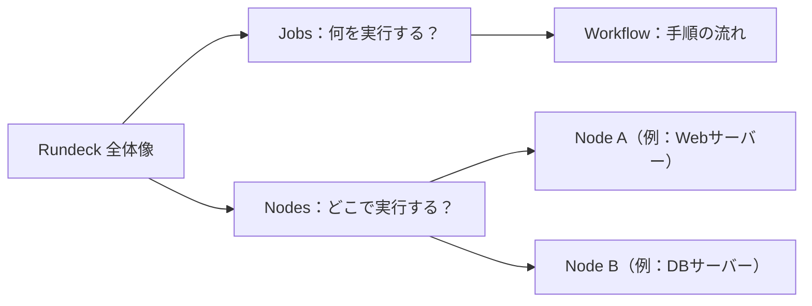
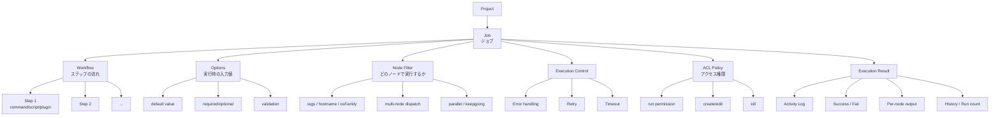
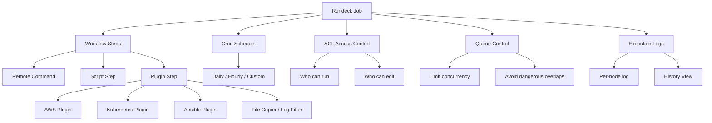

RUNECK（**Rundeck** が正式名称）とは、
**インフラ運用・システム運用を自動化・可視化するための “運用オーケストレーションツール”** です。

エンジニアや運用チームが、サーバーの定期作業・ジョブ実行・障害対応などを **GUI + スクリプトで自動化** できる仕組みを提供します。


## ✅ **何ができる？（主な機能）**

Rundeck は、運用現場で発生する定型作業を「安全・確実・再現性高く」実行できるようにする自動化プラットフォームです。

ジョブのスケジュール実行や手動実行、SSH/API を使ったサーバー操作、GUI からのワンクリック実行、権限管理（RBAC）、実行ログの集中管理、障害対応手順の標準化など、インフラ運用に必要な機能を一通り備えています。開発者・運用者・非エンジニアがそれぞれの権限範囲で作業を実行できるため、ヒューマンエラーの削減や運用効率の向上にも貢献します。

🔗 公式ドキュメント：
https://docs.rundeck.com/docs/

### **1. 運用作業の自動化（ジョブ管理）**

* Cron のようにスケジュール実行
* 手動実行も可能
* SSH や API を使ってサーバーにコマンドを実行
* シェルスクリプト・Python・Ansible と連携

### **2. Web 画面から操作可能（GUI）**

エンジニアでなくても、ボタン1つで運用作業を実行できます。

### **3. 権限管理（RBAC）**

* 誰が何を実行できるか細かく制御
* オペレーターとエンジニアの役割分割ができる

### **4. 実行ログを一元管理**

どのサーバーで何を実行したか、履歴とログが自動で保存されます。

### **5. インシデント対応の標準化**

事前に「対応手順をジョブ化」しておけば、
障害時にワンクリックで定型対応を実施可能。


## ✅ **どんな場面で使われる？（例）**

Rundeck は、毎日行う定例作業やバッチ処理、トラブル時の対応など、運用チームが普段行っている「決まった作業」を自動化するときに使われます。

たとえば、夜間に自動でデータ集計を実行したり、サーバーの再起動やキャッシュ削除をワンクリックで行えるようにしたり、非エンジニアでも安全にバックアップ作業だけを実行できるように権限を分けたりする場面で使われます。また、監視アラートが発生した際に、あらかじめ登録しておいた対応処理を自動で走らせることで、トラブル対応を効率化することも可能です。

つまり、Rundeck は「人が毎回手でやっていた面倒な作業」を、自動化・標準化してくれる便利な運用支援ツールです。

### **① バッチ運用の自動化**

* データ集計バッチ
* 毎日の定期処理
* 複数サーバーへの一括デプロイ

### **② SRE・運用チームの効率化**

* サーバー再起動
* キャッシュ削除
* ログ収集
* 監視アラートから自動実行

### **③ 権限を分けた安全な運用**

例：
「非エンジニアが、Rundeck 上のボタンだけで DB バックアップを実行できる」

### **④ DevOps の自動化オーケストレーション**

Ansible、Terraform、Jenkins、AWS などと連携可能。


## ✅ **Rundeck を一言でまとめると？**

> **運用チームが、「誰でも安全に」定型作業を実行できるようにする自動化プラットフォーム。**

AWS Systems Manager や Ansible Tower のような位置づけです。


## 🔎 **似ているサービスとの比較**

Rundeck は「運用自動化」に特化したツールですが、同じく自動化を扱う Jenkins や Ansible Tower、AWS Systems Manager とは目的と役割が少しずつ異なります。

Jenkins は主にアプリケーションのビルドやデプロイを行う CI/CD ツールで、開発工程を自動化する場面で使われます。一方、Ansible Tower はサーバー構成の自動化が中心で、インフラの初期設定や構成管理に強みがあります。AWS SSM は AWS 環境に限定される代わりに、パッチ適用やリモート実行が統合されたクラウド運用サービスです。

それに対して Rundeck は、障害対応・日次作業・バッチ処理といった「運用フェーズの定型作業」を安全に標準化することを目的としており、チーム内での役割分担や GUI での簡易操作が必要な場面に向いています。

| ツール               | 用途          | 特徴            |
| -- | -- | - |
| **[Jenkins](https://www.jenkins.io/doc/)**       | CI/CD（開発寄り） | ビルド・テスト・デプロイ  |
| **[Rundeck](https://docs.rundeck.com/docs/)**       | 運用自動化（Ops）  | 障害対応・バッチ・日次作業 |
| **[Ansible Tower](https://docs.ansible.com/)** | 構成管理 + 運用   | インフラ自動化に強い    |
| **[AWS SSM](https://docs.aws.amazon.com/systems-manager/)**       | AWS 運用      | AWS に限定       |


## ✅ **Rundeck 学習の最初のステップ（実務者向け・最短ルート）**

### **① ざっくり仕組みを理解する（30分）**

まずは「Rundeckは何を解決するツールか？」を把握します。

**Rundeckとは？**
運用自動化ツール。
ジョブを登録し、サーバー群（Nodes）に対して、コマンドやスクリプトを自動実行できる。
→ つまり **運用の標準化・自動化** のためのツール。

見るべき場所：

* Getting Started（今開いている部分）
* Jobs（ジョブとは何か）
* Nodes（ターゲットとなるサーバー群）


### **② 実際に触る（ローカルorDockerで即構築）**

学ぶ一番早い方法は **実際にジョブを作って動かすこと**。

#### ▼ 一番簡単な環境構築

```bash
# pull rundeck image from docker hub
docker pull rundeck/rundeck:5.17.0

# run docker image
docker run -p 4440:4440 rundeck/rundeck:5.17.0

```

実行するとログが流れて、起動完了すると：

→ ブラウザで `http://localhost:4440` を開けばOK
→ admin / admin でログイン

🔑 ログイン情報（デフォルト）
```
username: admin
password: admin
```

ログを見る限り……

🎉 **Rundeck、完全に起動 & ログイン成功してます！**

ログ内容：

* `Started Application in 173s` → 起動成功
* `login_success` → **admin でログイン成功**
* `GET /` → **トップページへのアクセス成功**


👉 **もう使える状態です！**


✅ 次に何をすればいい？

初学者向けに「最初にやるべき3ステップ」を案内します。


#### **① 新規プロジェクトを作る**

左上メニュー →
**“Project” → “Create New Project”**

* Project Name: `test-project`
* その他はデフォルトでOK


#### **② ジョブを作る（Rundeckの基本単位）**

左メニュー → Jobs → “Create a new job”

##### 設定例👇

#### General

* Job Name: `hello-world`

#### Workflow（1ステップだけ追加）

* Command → `echo "Hello, Rundeck!"`


#### 保存（Save）


#### **③ ジョブを実行する**

ジョブ画面 → **Run Job**（今すぐジョブを実行）

ログ画面に

```
Hello, Rundeck!
```

と出たら成功。


🌟 これで Rundeck の核心「Job」「Workflow」が理解できます。


### **③ Nodes（ノード）を理解する：実務で最重要**

**Rundeck では **どのサーバーに** ジョブを実行するかが重要。**

Rundeck を本当に「使いこなす」ために最も重要なのが、Nodes（どのサーバーで実行するか）と Jobs（何を実行するか）の理解です。

Nodes はジョブの実行先となるサーバーやコンテナのリストで、Rundeck がどの環境に対して処理を行うかを決める役割を持っています。

一方 Jobs は実行する作業そのもので、1つの作業を「Workflow」という複数ステップの流れとして管理できます。

つまり、Nodes＝実行対象、Jobs＝実行内容という構造を理解しておくと、Rundeck が「対象を選び、決まった手順を自動実行する」仕組みが直感的に分かるようになります。

この2つの概念を押さえることが、運用自動化の設計を効率的に進める第一歩です。



Rundeck の仕組みはたった2つ：
- Nodes（どこで実行する？）
→ サーバー / コンテナ / EC2 インスタンスのこと
- Jobs（何を実行する？）
→ コマンドやスクリプトをまとめた「作業指示」

そして Job は Workflow として複数ステップをまとめられる。

つまり：

- Nodes = 実行対象
- Jobs = 実行内容
- Workflow = 手順の流れ

🔗 関連公式ドキュメント

- Nodes（実行ターゲット）：https://docs.rundeck.com/docs/manual/projects/nodes/
- Jobs（ジョブ定義）：https://docs.rundeck.com/docs/manual/jobs/

#### ノードの定義方法（SSH / WinRM / Kubernetes など）

Rundeck では、ジョブを実行する対象サーバーを「ノード」として登録します。

登録方法はいくつかあり、最も一般的なのは SSH で Linux サーバーを登録する方法です。Windows サーバーの場合は WinRM、クラウド環境やコンテナ基盤の場合は Kubernetes の API から自動でノード情報を取得することもできます。

ノード定義は YAML / JSON ファイルで手動記述することもでき、構成管理ツール（Ansible・Chef など）と連携して自動取得させることも可能です。

#### ノード属性（tags / hostname など）

各ノードには「hostname」「username」「osFamily」「tags」などの属性を持たせることができ、Rundeck はこれらの属性を使って接続方法や実行権限を判断します。特に tags は重要で、「web」「db」「prod」「stg」など役割を表すキーワードを付けておくことで、どの種類のサーバーに実行するかを柔軟に指定できるようになります。属性は YAML 定義ファイルに書くほか、クラウド API から自動的に取り込むこともできます。

#### Node filter で対象を絞り込む方法

ジョブを実行するとき、Rundeck では “ノードフィルター” を使って実行対象のサーバーを絞り込みます。

たとえば「tag:web」だけに実行したり、「osFamily:linux」だけを対象にしたり、「hostname:prod-*」のようにパターンで選ぶこともできます。複数条件を組み合わせることもできるため、「本番環境の Web サーバーだけ」や「DB 以外のすべて」など、細かく実行対象をコントロールできます。

これにより安全で確実な運用が行えるのが Rundeck の大きなメリットです。

#### 👉 まずは YAML の simple ノード定義から入るのが楽。

Rundeck では Node Source（リソースモデル）の形式として、以下の3種類が使えます：
| 形式       | 説明                                                  |
| -- |  |
| **XML**  | `<project><node ... /></project>` 形式。最も公式の古典的フォーマット |
| **YAML** | `resource-yaml-v13` 形式。人気で見やすい                      |
| **JSON** | JSON 形式でも定義可能                                       |


Rundeck で扱うノード（実行対象サーバー）は、定義ファイルに以下のように定義できます。

| フィールド           | 説明                                         |
|  |  |
| **hostname**    | 接続先の IP / ホスト名。Rundeck が SSH する先。          |
| **username**    | SSH 接続に使うユーザー名。                            |
| **description** | ノードを説明する一言。GUI に表示される。                     |
| **tags**        | Web / DB / prod / stg などの分類。フィルターで絞り込みに使う。 |
| **osFamily**    | linux / windows など。実行できるコマンドを判断する材料。       |

##### YAML
```yaml
# nodes.yaml（最小例）
node1:
  hostname: 192.168.1.10
  username: ubuntu
  description: "Web サーバー"
  tags: ["web", "prod"]
  osFamily: "linux"

node2:
  hostname: 192.168.1.20
  username: ubuntu
  description: "DB サーバー"
  tags: ["db", "prod"]
  osFamily: "linux"

```
##### XML
```xml
<?xml version="1.0" encoding="UTF-8"?>
<project>
  <node name="node00"
        description="Linux Node 00"
        tags="db"
        hostname="192.168.56.20"
        osFamily="unix"
        username="vagrant"
        ssh-key-storage-path="keys/rundeck"
  />

  <node name="windows"
        description="Windows Server"
        tags="ad"
        hostname="192.168.56.23"
        osFamily="windows"
        username="rundeckuser"
        winrm-password-storage-path="keys/windows.password"
        winrm-authtype="basic"
        node-executor="WinRMPython"
        file-copier="WinRMcpPython"
  />
</project>

```


✔ これだけで Rundeck は 2台の Linux サーバーを実行対象として認識 します。

✔ SSH で接続できる設定（鍵や権限）はサーバー側が前提になります。

🔗 公式ドキュメント（Node 定義）：

https://docs.rundeck.com/docs/manual/05-nodes.html


### **④ Jobs（ジョブ）を深く理解する**

**Jobs は「どのノードで実行する？」を常に意識します。**

Rundeck の「ジョブ」は、運用作業を自動化するための基本単位で、サーバー上で実行したいコマンドやスクリプト、複数の手順（Workflow）をまとめた“作業のレシピ”のようなものです。

ジョブには、どのノードで実行するかを指定する「Node Filter」、実行時に値を受け取るための「Options」、失敗時の再実行やタイムアウトなどの「実行制御」、さらに誰が実行できるかを決める「ACL」などが組み込まれており、運用現場で必要な機能が一つに統合されています。

これにより、日次バッチから障害対応まで、あらゆる運用手順を“安全・確実・再現性のある形”で標準化できるのがジョブの最大の特徴です。

- Job＝自動化の単位
- Workflow（Step）＝何を実行するか
- Node Filter＝どこで実行するか
- Options＝引数
- ACL＝誰が実行できるか
- Log/History＝結果の可視化



#### Workflow（複数ステップの実行）
Rundeck の Workflow（ワークフロー） は、ジョブの中で「どんな手順を、どの順番で実行するか」を定義する最重要機能です。

1つのジョブは 1 つの Workflow を持ち、Workflow の中には複数の Step（ステップ）を追加できます。各ステップは「コマンドを実行する」「スクリプトを実行する」「プラグインを呼び出す」「別のジョブを呼び出す」などさまざまな処理を担当し、これらが順番に実行されることで、運用作業を一連の流れとして自動化できます。

また、ステップ失敗時の挙動（続行・停止・再試行）を細かく制御したり、複数ノードへの並列実行や条件分岐を設定することも可能です。

つまり Workflow は、単なる「コマンドの羅列」ではなく、現場の運用手順そのものを精密に再現・自動化するための強力な仕組みであり、Rundeck を使いこなす上で避けて通れない中心機能といえます。

#### Workflow の構造（Sequential / Parallel）

Rundeck の Workflow は、複数ステップを「どの順番で」「どのノードに対して」実行するかを定義する仕組みです。基本構造は Sequential（順次実行） と Parallel（並列実行） の2種類で、ジョブの内容によって使い分けます。

Sequential は Step1 → Step2 → Step3 のように一つずつ処理する形式で、依存関係がある作業や慎重に進めたい運用に向いています。

一方 Parallel は複数ステップを同時に実行できるため、大量のノードへ一括で処理したい場合や、複数の作業が互いに独立している場合に有効です。

さらに、ノード単位でも Sequential / Parallel の切り替えができるため、「複数ノードで同じ処理を並列実行」「本番系だけ順次、ステージングは並列」といった柔軟な運用設計も可能です。

📌 よく使うワークフロー機能

- Sequential（順次実行）
- Parallel（並列実行）
- Node-first / Step-first
- Error handling（エラー時に代替Step実行）
- Job Reference（別ジョブを呼ぶ）
- Plugin Step（カスタムプラグイン）

#### ✔ Workflow Step の種類まとめ表
Rundeck の Workflow で使える Step は大きく Command / Script / Job Reference / Plugin の4カテゴリに分かれます。
実務では 8割が「Command」「Script」「Job Reference」です。

| 種類                               | 説明                        | 典型的な用途                              |
| -- | - | -- |
| **Command Step**                 | サーバー側で任意のコマンドを実行          | `systemctl restart app`、`ls`、`curl` |
| **Script Step**                  | シェルスクリプト or インラインスクリプトを実行 | 複雑な処理、複数行の操作                        |
| **Script File or URL**           | 外部スクリプトファイルを取得し実行         | Git 管理の Script 共有など                 |
| **Job Reference Step**           | 他のジョブを呼び出す                | サブジョブ化、再利用、共通化                      |
| **Plugin Step**（Node / Workflow） | プラグインを使った処理               | AWS、Kubernetes、Ansible など連携         |
| **Inline Script**                | GUIで直接書く一時スクリプト           | 1〜5行の簡易処理                           |
| **Log Filter Step**              | ログを加工、抽出、整形               | 正規表現抽出、マスキングなど                      |
| **Error Handler Step**           | 失敗時に実行されるステップ             | リトライ、ロールバック処理                       |
| **Node Step / Workflow Step**    | ノードごと実行 or ワークフロー全体に適用    | 大量ノード処理、集約処理                        |


👉 実務でよく使う組み合わせ

- Command → Job Reference → Command（標準）
- Script → Script → Error Handler（複雑な手順）
- Parallel Node Dispatch + Command（大量ノードへの同時コマンド）

🔗 公式（Workflow）
https://docs.rundeck.com/docs/manual/jobs/job-workflows.html

#### Plugin（たくさんある運用系プラグイン）
Rundeck には非常に多くのプラグインが用意されており、サーバー操作・クラウド連携・ログ処理などの運用作業を大幅に効率化できます。たとえば AWS・Kubernetes・Ansible など外部サービスと連携するプラグインもあれば、ノード操作やファイルコピー、ログ整形など Rundeck 内部で動作するプラグインもあります。基本機能だけでも使えますが、プラグインを活用することで「運用作業の自動化幅」が一気に広がるのが Rundeck の大きな特徴です。

#### スケジュール（cron）
ジョブは cron のようにスケジュール設定でき、毎日・毎時・毎分など好きな間隔で自動実行できます。
夜間バッチ、定時バックアップ、監視情報の定期収集など、手作業だと忘れがちな処理を確実に自動化できます。GUI で時間を指定できるため、cron の書き方を覚えていなくても問題ありません。

#### ログ出力の管理
Rundeck は、ジョブ実行時のログをすべて自動で収集・保存します。
どのノードで何が起きたか、成功したか失敗したか、いつ誰が実行したか、といった運用履歴をすべて GUI で確認できるため、トラブル調査が圧倒的に楽になります。ログはノードごとに分割表示されるため、複数サーバー同時実行時でも追いやすい点が大きなメリットです。

#### 実行ユーザー制御 / キューミング
ジョブの実行には「誰がどのジョブを実行できるか」という権限を細かく設定できます。
管理者だけが実行できるジョブ、オペレーターでも安全に実行してよいジョブ、といった運用分担がしやすく、ヒューマンエラー防止に役立ちます。

また、ジョブの“キュー（待ち行列）”管理も可能で、同時に走ると危険な処理を一度に一つだけに制限することもできます（DBメンテナンスやデプロイ系作業など）。

##### 👉 特に **Remote Command** と **Script** が基本。
Rundeck で最もよく使うのが「Remote Command」と「Script」です。

Remote Command
SSH 経由で任意のコマンドを実行する基本機能。
systemctl restart app、ls、curl などの単純操作はほぼこれで完結します。

Script / Script File / Inline Script
複数行の処理や条件分岐、API 連携など、少し複雑な運用手順はスクリプトとしてまとめて実行できます。
Bash・Python・PowerShell など環境に応じて使えます。

実際の現場では、
「Remote Command（単発処理）」＋「Script（複雑処理）」
の組み合わせで 8〜9割の運用作業をカバーできます。

##### Rundeck 実行の基本構造（Plugin / Cron / Logs / ACL / Queue）


**Workflow Steps（ジョブの中身）**

ジョブを構成する手順。
その中核は Remote Command と Script。
実務の 8〜9 割がこの2つで構成される。

**Plugin Step（拡張機能）**

外部サービス連携（AWS / K8s / Ansible）や
ファイルコピー、ログ整形などを追加できる。

**Cron Schedule（自動実行）**

毎日・毎時・毎分など、定期実行を GUI で設定可能。

**ACL（アクセス制御）**

誰が実行できるか・編集できるかを細かく管理。
運用現場で最も重要な安全機構。

**Queue Control（キュー管理）**

危険な処理を同時実行しないよう
"一度に1つだけ実行" 制御ができる。

**Logs（ログ管理）**

実行ログ、履歴、ノード別ログを自動保存し、
障害調査や運用改善に使える。

🔗 公式ドキュメント（Jobs）：
https://docs.rundeck.com/docs/manual/jobs/


### **⑤ Secrets / Access Control（ACL）を理解する**

現場で絶対必要になる部分。

#### Secrets（機密情報）

- Rundeck が SSH鍵やパスワードを安全に保管する仕組み
- ジョブ内で `${secret.xxx}` として参照
- “誰が使えるか” を設定できる

#### ACL（アクセス制御）

- プロジェクトごと、ジョブごとに「実行／編集／閲覧」権限を細かく設定
- 誤操作防止の中心になる安全機構
- YAML 定義で柔軟に管理できる

→ 運用チームではここが超重要。
- 権限を誰でも実行できる状態は “危険”
- 本番では必須の設定要素


### **⑥ 最後に、運用ワークフローを作ってみる**

学習のゴールは「自分の環境にジョブを組める」こと。

例：

* GitPull → Build → Deploy の簡単 CI/CD
* 一括ログ収集ジョブ
* アプリ再起動ジョブ
* バッチ処理実行ジョブ
* 定時バックアップジョブ

**実務で使える形を1つ作れば理解が一気に深まります。**


## 🎯 **最短の理解ルート**

**① 体験する（Docker）**

ジョブ作成 → 実行 → ログを見る
（30分〜1時間）

**② Nodes と Jobs をしっかり理解**

Rundeck の本質はここ。

**③ Secrets / ACL を理解**

運用現場では絶対に必要。

**④ プラグインを触る**

→ AWS / Kubernetes / Ansible など

**⑤ CI/CD やサーバー運用に組み込む**

ここまで来ると一人でプロダクション設計できる。


#### ✦ まず何からやればいい？ 

**Docker で Rundeck を立ち上げて、ジョブ1個作る**
これが一番早いし、学習効率が最高。
