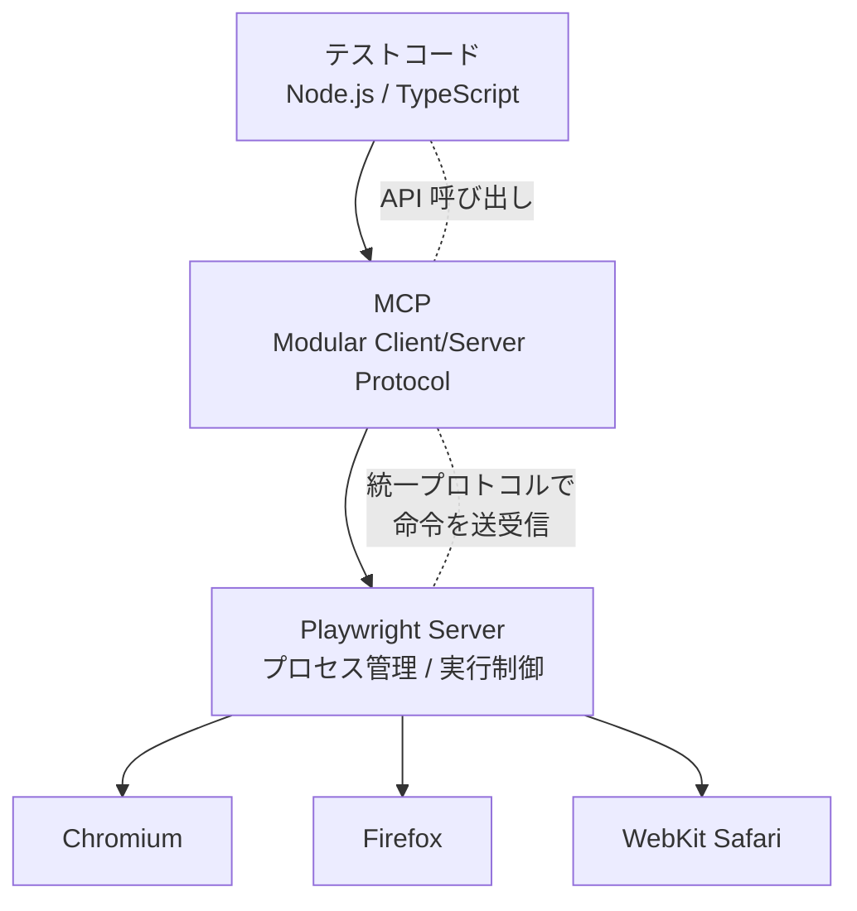

## ✍️ **0. はじめに**

モダンな Web 開発では、UI の複雑化やブラウザ環境の多様化によって、
**E2E テスト（End-to-End テスト）の重要度が年々高まっています。**

ユーザーが実際に操作する動きを再現してテストするため、
「気づけてよかったバグを事前に防げる」というメリットがある一方で、
現場ではこんな悩みもよく耳にします。

* テストが**すぐ壊れる（flaky）**
* ブラウザごとに挙動が違い、**Safari だけ落ちる**
* テストが**遅くて CI の実行時間が伸びる**
* デバッグが手間で、**原因を特定するのに時間がかかる**

<!--  -->

特に日本市場は iPhone ユーザーが多く、
**WebKit（Safari）向けの動作保証**は避けて通れません。
そのため、E2E テストに求められる基準は以前よりもずっと高くなっています。

こうした背景の中で、最近強く注目されているのが **Playwright** です。
Microsoft が開発するこのツールは、
「マルチブラウザ対応・高速・壊れにくい・デバッグしやすい」
という点で開発者の支持を広げています。

そして 2024〜2025 年にかけて、Playwright はさらに進化しました。
その鍵となるのが、あまり知られていないけれど強力な仕組みである **MCP（Modular Client/Server Protocol）** です。

MCP は Playwright の内部構造を根本から見直した
**“次世代の通信プロトコル”** で、
安定性、速度、拡張性のすべてに影響を与えています。

> 「なぜ Playwright が安定していて速いのか？」
> 「MCP はどうして注目されているのか？」
> 「実際にどう使うの？」

この記事では、これらの疑問に答えながら、
**Playwright × MCP の全体像を“分かりやすく”まとめて紹介**していきます。

## ✍️ **1. Playwright を選ぶ理由**

E2E テストのツールはいくつもありますが、
Playwright がここ数年で一気に「第一候補」になったのには理由があります。
特にフロントエンド開発が TypeScript へシフトし、
UI が複雑化していく中で、Playwright は **「今の時代にとてもフィットしたツール」** に成長しました。

ここでは、Playwright が選ばれる主な理由を整理していきます。


### **1.1 マルチブラウザ対応（Safari までカバーできる強さ）**

Playwright 最大の特徴は、最初から **3 ブラウザ（Chromium / Firefox / WebKit）を公式サポートしている**ことです。

特に WebKit（Safari）対応は非常に大きいポイントです。

> 日本市場は iPhone シェアが高く、
> **Safari で壊れると売上やユーザー体験に直結する**。

Selenium でも Safari は扱えますが挙動が安定しないことが多く、
Cypress は Safari をそもそもサポートしていません。

Playwright のメリットは、
**1つのテストコードで 3 つのブラウザを同じように動かせる**こと。
これだけでも選択理由として十分と言えるほど大きいです。


### **1.2 Auto-wait による“壊れにくいテスト”**

E2E テストがツラい理由の 1 つに、
**“テストがすぐ壊れる（flaky）”** という問題があります。

* 画面のロードが遅い
* 非同期処理が終わっていない
* DOM がまだ更新されていない
* アニメーション中でクリックできない

こうした要因で、
「ローカルでは通るのに CI で落ちる」
という現象が発生しがちです。

Playwright はここが非常に強く、**ほとんどの操作に対して自動で待機（auto-wait）** をしてくれます。

* 要素が「見えるまで」待つ
* クリック可能になるまで待つ
* URL が変わるまで待つ
* ネットワークが安定するまで待つ

これらの待機を“勝手にやってくれる”ため、
**テストの安定性が段違い**です。


### **1.3 並列化が標準装備で速い**

Playwright は **テストの並列実行が標準**です。

CI/CD でテストが多くなるほど、この並列化は効いてきます。

* 多くのテストを同時に実行
* ブラウザコンテキストを素早く立ち上げる
* マシンパワーを最大限に使える

結果として：

> **“遅い E2E テスト”が、“回せる E2E テスト”に変わる。**

開発速度に直結するので、ここも Playwright の大きな魅力です。


### **1.4 デバッグが圧倒的に楽（Trace Viewer）**

E2E テストは、失敗した時が本番です。

従来は、失敗ログやスクリーンショットを見ても
「結局どこで何が起きたの？」がわからず、
原因調査に時間がかかることが多いものでした。

Playwright の **Trace Viewer** は革命的です。

* 失敗時の操作ログ
* 各ステップのスクリーンショット
* ネットワークログ
* コンソールログ
* DOM snapshot
* クリックの座標までわかる

これを“可視化して時系列で再現”してくれるので、
**原因特定が圧倒的に速い**です。


### **1.5 TypeScript がデフォルトで使いやすい**

Playwright は最初から TypeScript 想定で作られているため、
TS プロジェクトとの相性がとても良いです。

* 型補完が標準で強い
* エディタ（VS Code）との連携が快適
* チーム開発の保守性が高い

フロントエンドが React / Vue / Nuxt などに寄っている現代では、
**TypeScript 前提の E2E ツールは非常に価値が高い**です。


### **1.6 「総合力が高い」ため結局 Playwright が残る**

E2E テストツールとしては Cypress も人気ですが、
Safari を含むマルチブラウザ、安定性、スピード、デバッグ性など、
**総合的に見ると Playwright が頭ひとつ抜けている**印象です。

> 「壊れにくい」「速い」「Safari もテストできる」
> → この3つを実現できるツールは Playwright 以外ほとんどありません。

## ✍️ **2. Playwright MCP とは何か**

Playwright が 2024〜2025 年にかけて大きく進化した背景には、
**MCP（Modular Client/Server Protocol）** の導入があります。

名前だけ聞くと「難しそう」「E2E と何の関係があるの？」と感じるかもしれませんが、
実はこの MCP が、**Playwright の“安定性・速度・拡張性”を支える土台**になっています。

では、MCP とは何なのでしょうか？


### **2.1 MCP の正体を一言でいうと？**

> **Playwright がブラウザを操作するための内部通信を、
> 完全に標準化・モジュール化した次世代プロトコル。**

これまでも Playwright は
「テストコード → Playwright → ブラウザ」
の形でテストを動かしていましたが、
その内部通信はブラウザごとに微妙に異なっていました。

MCP はこの内部構造を **ゼロから統一的なプロトコルに作り直したもの**です。

これにより、
Chromium / WebKit / Firefox を扱う“内部ロジック”の不一致が解消され、
Playwright 全体の挙動がより安定し、より高速になりました。


### **2.2 なぜ MCP が必要だったのか？**

Playwright の利用者が増えるにつれ、
技術的に次の課題が浮き彫りになってきました。

#### ✔ ブラウザ間の細かい差異を吸収するコストが大きい

Chromium・WebKit・Firefox は内部構造がまったく違います。
従来の方式では、それぞれに合わせた通信処理が必要で、
**アップデートのたびに調整が多く発生していました。**

#### ✔ E2E テストの安定性を高めるには統一された処理が必要

自動待機、ネットワーク制御、トレース記録など、
Playwright 独自の機能が増えるほど、
内部のやり取りには **強い一貫性** が求められます。

#### ✔ 将来的な AI × E2E の時代に対応するため

例えば OpenAI の **MCP（Model Context Protocol）との連携** や、
ブラウザ操作の自動生成など、
より柔軟な外部連携が必要になってきました。

> これらをすべて実現するために、
> Playwright は内部を抜本的に刷新し、
> **共通プロトコルとしての MCP を導入した**
> という流れです。


### **2.3 MCP のメリット（実務で効いてくるポイント）**

#### **メリット ①：ブラウザ差異の吸収 → 安定性が高い**

同じ命令が MCP によって共通形式に変換され、
サーバ側が各ブラウザに合わせて最適な命令を送るため、
**ブラウザごとの癖による不安定さが改善**されました。

#### **メリット ②：通信の高速化 → 並列実行がよりスムーズ**

古い通信方式より軽量で、実行のオーバーヘッドが減り、
**テストスピードが向上**します。

#### **メリット ③：トレース・ネットワークログなどの機能が統一的に扱われる**

内部処理が一本化されたことで、
**ログ取得・トレースの一貫性が向上**し、
デバッグがさらにやりやすくなりました。

#### **メリット ④：外部ツールや AI との連携が強化**

MCP は “モジュール化されたプロトコル” なので、
外部からブラウザ操作命令を送りやすくなっています。

> → 最近流行りの「AI がブラウザを自動で操作する」デモも
> Playwright MCP が基盤になって動いている。

#### **メリット ⑤：Playwright の進化が止まらない理由**

Playwright チームは MCP を基盤として
今後さらに多くの機能を乗せていく予定で、
**長期的な伸びしろが大きいフレームワーク**になっています。


### **2.4 要するに、MCP は Playwright の“エンジン刷新”**

一般的にはあまり表に出ない話ですが、
Playwright が「壊れにくい」「速い」「拡張性が高い」と言われる背景には、
**MCP という内部エンジンのアップグレードがある**ということです。

> 外から見える API は変わらないけれど、
> 中身はまるごと最新仕様に進化している。

この構造理解があると、
Playwright の強さがより鮮明に見えてきます。

## ✍️ **3. MCP のアーキテクチャ（図解）**

Playwright MCP を理解する上でいちばん重要なのは、
**「テストコードからブラウザまで、どのように命令が流れるか」** を把握することです。

仕組みを複雑に感じる人も多いですが、
実際の構造は非常にシンプルに整理できます。

Playwright のアーキテクチャは、次の 4 層で構成されています。


### **3.1 全体構造（図解）**



### **3.2 各レイヤーの役割をもっと簡単に言うと**

#### ✔ **① テストコード**
`page.goto()` や `page.click()` などの Playwright API を呼び出す。
```typescript
import { test, expect } from '@playwright/test';
test('example test', async ({ page }) => {
  await page.goto('https://example.com');
  await expect(page).toHaveTitle('Example Domain');
});
```


#### ✔ **② MCP**

Playwright チームが新しく導入した **“統一通信プロトコル”**。
ここがポイント：

* テスト操作を共通の命令セットに変換
* ブラウザ差異を吸収する基盤
* 外部ツール（AI など）との連携もしやすい

ようするに **Playwright の心臓部分**。


#### ✔ **③ Playwright Server**

MCP の命令を受け取り、
**ブラウザに対して実際の命令を実行する中間レイヤー**。

同時に：

* セッションの管理
* DOM の状態チェック
* 自動待機（auto-wait）
* トレース・ネットワークログの取得

こうした Playwright の“強みの機能”を一手に担う。


#### ✔ **④ Browser Engines**

* Chromium（Chrome）
* Firefox
* WebKit（Safari）

従来はブラウザごとに挙動が違い、制御が難しかった。
MCP によって命令体系が統一され、

> **「1つのテストコードで全ブラウザを確実に動かせる」**

環境が整った。


### **3.3 なぜ MCP のアーキテクチャが重要なのか？**

MCP の導入によって得られるメリットは非常に大きいです。

#### ✔ ブラウザ差異の吸収

Safari／Firefox／Chromium の違いを MCP が隠蔽してくれる。

#### ✔ 安定性の向上

内部処理が統一されたため、
“ブラウザごとの挙動差で落ちる E2E” が減る。

#### ✔ 並列実行の高速化

通信が軽くなり、同時実行の負荷が低減。

#### ✔ トレース・ネットワーク制御との一貫性

デバッグ関連の機能がさらに強力に。

#### ✔ 外部ツールとの連携強化

AI によるブラウザ操作（例：MCP クライアント）などの活用が広がる。


### **3.4 要するに、MCP のおかげで Playwright は“別次元の使いやすさ”に進化した**

従来の Playwright も十分強力でしたが、
MCP によって内部が統一化されたことで、

* **壊れにくい**
* **速い**
* **将来拡張がしやすい**

という“三拍子そろったテスト基盤”になりました。

ユーザー（テストを書く側）は MCP を意識する必要はありませんが、
この仕組みを知っていると
**「なぜ Playwright が選ばれるのか」** をより深く理解することができます。

## ✍️ **4. MCP の使い方**

ここまで MCP の仕組みやメリットを解説してきましたが、
いちばん気になるのはやはり **「で、どうやって使うの？」** という部分だと思います。

結論から言うと──

> **MCP のために特別な設定も、新しい API も必要ありません。
> いつもどおり Playwright を使えば、裏で自動的に MCP が働きます。**

つまり、開発者が MCP を“操作”することはありません。
普段書いているテストコードが、そのまま MCP ベースの高速・安定な実行経路で動いているだけです。


### **4.1 普段どおり Playwright でテストを書く（例）**

例えば、以下のような基本的なテストがあります。

```ts
import { test, expect } from '@playwright/test';

test('ページタイトルが正しく表示される', async ({ page }) => {
  await page.goto('https://example.com');
  await expect(page).toHaveTitle(/Example/);
});
```

これだけで OK です。
この `page.goto()` や `page.click()` といった API の呼び出しが、
内部で **MCP → Playwright Server → ブラウザ** の順に流れていきます。

開発者はその流れを意識する必要はありません。


### **4.2 設定ファイルも特別な記述は不要**

標準的な `playwright.config.ts` も従来通りです。

```ts
import { defineConfig } from '@playwright/test';

export default defineConfig({
  use: {
    headless: true,
    trace: 'on',
  },
  projects: [
    { name: 'chromium', use: { browserName: 'chromium' } },
    { name: 'webkit', use: { browserName: 'webkit' } },
  ],
});
```

ここでも MCP に関する設定は一切ありません。
`browserName` を書くだけで、
全てのブラウザが MCP 経由で統一的に動きます。


### **4.3 MCP が“勝手に効いてくる”場面**

Playwright を普通に使っているだけで、
MCP のメリットは日常的に発揮されます。

#### ✔ **複数ブラウザテスト**

Safari（WebKit）を含む3ブラウザを同じコードで動かせる。

#### ✔ **並列実行（高速化）**

内部通信が軽く統一されているため、
並列実行での速度面が向上。

#### ✔ **Trace Viewer / network log の安定性**

ログが MCP 基盤で一貫して取得され、
デバッグの質が高い。

#### ✔ **auto-wait の精度向上**

DOM 状態やネットワーク状態の監視を MCP が支える。

#### ✔ **外部ツールとの連携（AI がブラウザ操作するなど）**

AI が MCP を通じて Playwright を操作するユースケースが増えている。


### **4.4 つまり、「使い方は変わらず、性能だけ上がる」のが MCP**

これが MCP の最大の魅力です。

開発者が学習コストを払わなくても、
MCP により Playwright が内部で「より強く」「より安定して」「より高速に」進化していきます。

最近のテストツールにはありがちな
“名前だけ変わるけど使い方が大きく変わる”
といった心配もありません。

> **MCP は Playwright の裏側のエンジンを静かにアップグレードする仕組みで、
> API レベルでは従来と同じ使い心地を保ちつつ、実行品質だけ改善される。**

ここが、Playwright が長く支持され続ける理由のひとつでもあります。

## ✍️ **5. Cypress / Selenium と比較**

E2E テストツールの選定でよく挙がる選択肢が **Selenium** と **Cypress**。
これらは長年プロジェクトで利用されてきた実績あるツールです。

ただし、Playwright が台頭している現在では、
**“どのツールを使うべきか”** を改めて比較する価値があります。

ここでは、

* Selenium
* Cypress
* Playwright
  の3つを、現場でよく問題になる観点から比較します。


### **5.1 結論：総合的に Playwright が最適解になりやすい**

最初に結論をシンプルにまとめます。

| 観点                 | Selenium | Cypress    | Playwright |
| -- | -- | - | - |
| マルチブラウザ（Safari）    | △        | ×          | ◎          |
| 安定性（auto-wait）     | △        | ○          | ◎          |
| テスト速度              | △        | ◎          | ◎          |
| 並列実行               | △        | △（有料CIが必要） | ◎          |
| TypeScript との相性    | △        | ○          | ◎          |
| デバッグ（Trace Viewer） | ×        | ○          | ◎          |
| モダンな設計・今後の伸びしろ     | △        | ○          | ◎          |
| AIとの連携（MCP）        | ×        | ×          | ◎          |

> **総合力で Playwright が最もバランスが良く、現代的な E2E テスト標準と言える。**


### **5.2 Selenium と比較（古い設計 vs モダン設計）**

Selenium は歴史が非常に長く、
WebDriver によるブラウザ操作の“原点”とも言える存在です。

しかし、その古さは同時に限界でもあります。

#### ❌ **難点：ブラウザ間の挙動差を吸収しづらい**

テストが壊れやすい（flaky）原因の多くがここにあります。

#### ❌ **Wait の手動管理が多い**

`implicit wait` / `explicit wait` など、
「待つ」処理の設定が開発者依存で、
安定性にバラツキが生まれやすい。

#### ❌ **並列実行が弱い**

構造上スピードが出にくい。


#### ✔ **Playwright が優れる点**

* auto-wait が標準のため壊れにくい
* 非同期 UI を前提に作られている
* 並列実行が最初から最適化されている
* Safari を含むブラウザが安定して動く
* Trace Viewer によるデバッグが圧倒的に楽

**→ Selenium の“弱点すべてに対して Playwright が強みを持っている”** という状態。


### **5.3 Cypress と比較（DX の高さ vs Safari 非対応）**

Cypress は DX（開発体験）の良さで強い人気があります。

* UI が綺麗
* インタラクティブな実行画面
* デバッグが簡単
* セットアップが楽

これは開発者にとって魅力的ですが、
現場レベルで以下の弱点が大きな制約になります。

#### ❌ **致命的：Safari（WebKit）をサポートしていない**

日本市場では特にこれが決定打になります。

> 日本は iPhone / Safari のユーザー割合が圧倒的。
> Safari テストができない = 実務で使えないケースが多い。

#### ❌ マルチブラウザは完全対応とは言いにくい

内部構造の都合で、どうしても制約が残る。

#### ❌ 並列実行は「有料（Cypress Cloud）」が前提

大規模組織ではコストが積み重なる。


#### ✔ **Playwright の勝ちポイント**

* **Safari を含む 3 ブラウザに完全対応**
* 並列実行が無料・標準
* auto-wait による安定性が高い
* MCP による内部統一で今後も進化確定
* トレース機能が強力でデバッグが速い


### **5.4 なぜ多くの企業が Playwright に移行しているのか**

理由はとてもシンプルで：

> **「ブラウザが複雑化するほど、Playwright の設計が活きてくる」**

特に最近の Web 開発は：

* SPA / SSR / SSG
* 非同期 UI
* モバイルブラウザ (WebKit) の存在
* CI/CD の高速化が必須
* AI による自動テスト生成の加速
* スクロールやアニメーションの多用
* ネットワーク制御・API モックの重要性

こうした環境では、
**古い E2E ツールは時代に追いつきづらい**。

その点 Playwright は：

* モダン
* 高速
* 安定
* AI 時代も前提に設計

という理想的な構成になっています。

## ✍️ **6. Playwright を採用するメリットまとめ（＋MCP の価値）**

ここまで、Playwright と MCP について
機能面・アーキテクチャ面・他ツール比較の観点から整理してきました。

最後に、
**「なぜ今 Playwright を選ぶべきなのか？」**
その理由をシンプルにまとめます。


### **6.1 現場で Playwright が選ばれる 5 つの理由（総合まとめ）**

#### **① マルチブラウザ（特に Safari）の安定サポート**

* Safari（WebKit）対応は実務上の最大の強み
* 日本市場では特に必須条件
* 同じテストコードで 3 ブラウザを確実に動かせる

→ **Selenium や Cypress では満たせない実務要件**


#### **② Auto-wait による“壊れにくい E2E”を実現**

Playwright の自動待機は非常に強力で、

* DOM が安定するまで
* 非同期が完了するまで
* アニメーションが終わるまで
* 要素がクリック可能になるまで

自動で待ってくれます。

結果として、

> **「ローカルだと通るけど CI で落ちる」問題が激減する。**

E2E テスト導入の大きな壁がこれによって大きく下がります。


#### **③ 並列実行が高速で無料**

Playwright は元から並列実行を前提に設計されており、
CI でも高速にテストを回すことができます。

* 大量テストを短時間で処理
* Cypress のように有料プランに頼らない
* 大規模プロジェクトにも耐える

→ **CI の時間短縮 = 組織全体の生産性向上**


#### **④ デバッグが圧倒的に強い（Trace Viewer）**

失敗時の可視化は業務インパクトが大きい。

* 各ステップのスクリーンショット
* DOM のスナップショット
* ネットワークログ
* コンソールログ
* 時系列での操作再現

開発者はストレスなく原因を特定でき、

> **「原因調査に1時間 → 5分」くらいの改善が普通に起きる。**


#### **⑤ TypeScript / モダン開発との相性が完璧**

* 型安全
* 補完が強い
* VS Code 上で快適
* TS ベースのフロントエンドに自然に統合できる

いまの React / Vue / Nuxt / Next ベースの開発には最適。


### **6.2 MCP が Playwright の価値をさらに押し上げている**

Playwright がここまで圧倒的な“総合力”を持っている理由の裏には、
**内部で動く MCP の存在**があります。

#### **MCP の価値をまとめると：**

* ブラウザ差異を内部で吸収して安定化
* テスト実行が高速に
* デバッグ関連の機能が一貫化
* 将来の拡張性が大幅に向上
* AI × テスト自動生成の基盤になる

特に、E2E テストの安定性は現場のストレスに直結します。
MCP のおかげで、より“壊れにくいテスト”を構築できるようになったのは
Playwright を選ぶ大きな理由のひとつです。


### **6.3 Playwright × MCP の組み合わせは「最も現代的な E2E テスト基盤」**

現代のフロントエンドは複雑で、
モバイルブラウザ（特に Safari）は避けて通れず、
CI/CD の高速化は必須です。

この環境で求められる要件を並べると：

* 複雑な UI を正しく操作できるテスト
* ブラウザ差異を最小化する仕組み
* 安定して動く
* デバッグしやすい
* 高速である
* TypeScript と自然に統合できる
* 将来的な AI 自動化にも対応できる

これらをすべて満たすツールは
**現状 Playwright だけ**と言ってよいでしょう。


### **6.4 まとめ：Playwright を採用する理由は“未来への投資”**

短期的にも強い。
長期的にも伸びる。

そして MCP のおかげで、
Playwright の内部エンジンはさらに進化し続ける土台が整いました。

> **E2E テストを本格導入するなら、
> Playwright を選ぶことは“未来へ投資する選択”である。**

この記事が、現場でのツール選定や
技術的な理解の助けになれば幸いです。

## ✍️ **7. 参考リンク（すべて有効 URL / 公式中心）**

### **◆ Playwright 公式ドキュメント**

#### **🔗 Playwright Top Page（公式）**

[https://playwright.dev/](https://playwright.dev/)

#### **🔗 Getting Started（公式チュートリアル）**

[https://playwright.dev/docs/intro](https://playwright.dev/docs/intro)

#### **🔗 Browsers（各ブラウザ対応の詳細）**

[https://playwright.dev/docs/browsers](https://playwright.dev/docs/browsers)

#### **🔗 Trace Viewer（公式デバッグツール）**

[https://playwright.dev/docs/trace-viewer](https://playwright.dev/docs/trace-viewer)

#### **🔗 Playwright release notes（MCP 対応の進化を追える）**

[https://github.com/microsoft/playwright/releases](https://github.com/microsoft/playwright/releases)


### **◆ Cypress / Selenium との比較で参照できる公式記事**

#### **🔗 Cypress - Why no WebKit（Safari）?（公式 Q&A）**

[https://docs.cypress.io/faq/questions/webkit-support](https://docs.cypress.io/faq/questions/webkit-support)

#### **🔗 Selenium WebDriver（公式ドキュメント）**

[https://www.selenium.dev/documentation/webdriver/](https://www.selenium.dev/documentation/webdriver/)


## 🔍 ※補足

Playwright MCP は「正式な一般向けドキュメント」がまだ少ないため、

* Architecture
* Server 実装
* Issue discussion
* Release notes
  などの一次情報を横断して理解する形が、現時点での最も正しい取得方法です。
