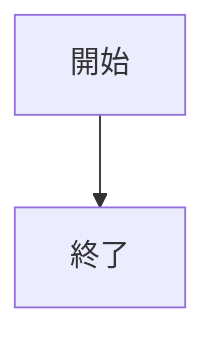
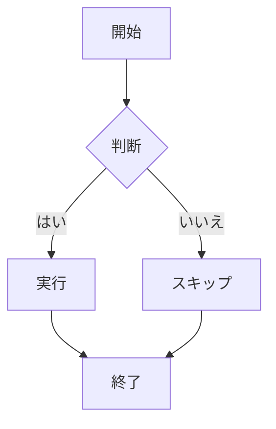
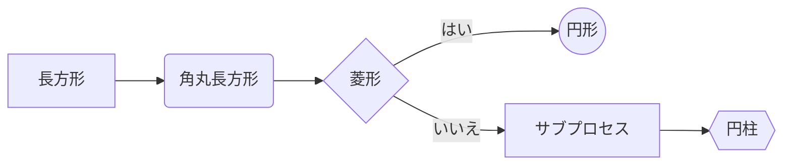
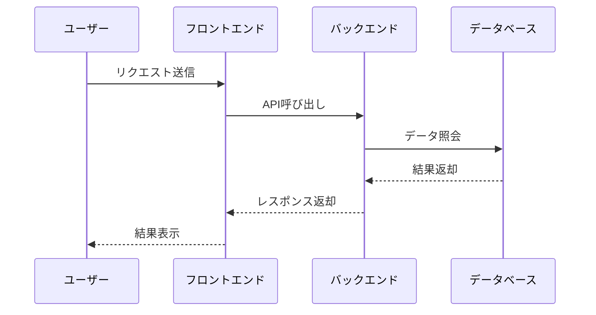
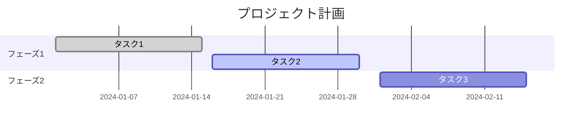
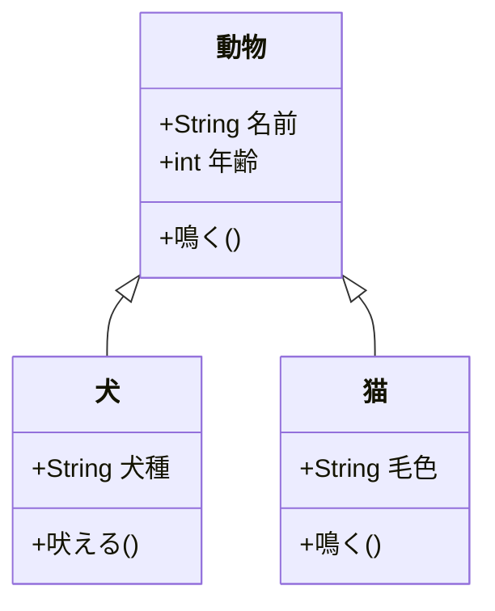
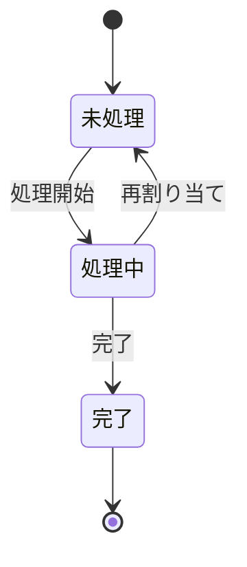

# Mermaid 利用ガイド

## 概要

Mermaid はテキストベースの図表生成ツールで、以下のようなさまざまな図をサポートしています：

* **フローチャート（Flowchart）**
* **シーケンス図（Sequence Diagram）**
* **ガントチャート（Gantt Chart）**
* **クラス図（Class Diagram）**
* **状態遷移図（State Diagram）**
* **ER図（Entity Relationship Diagram）**
* **ユーザージャーニー（User Journey）**
* **Gitグラフ（Git Graph）**

## 基本構文

Markdownファイル内で以下のような構文を使ってMermaidの図を作成します：

````markdown

````

## フローチャート（Flowchart）

### 基本構文



### ノードの形状

* `[]` - 長方形
* `()` - 角丸長方形
* `{}` - 菱形（条件分岐）
* `(())` - 円形
* `[[]]` - サブプロセス
* `{{}}` - 円柱形

### 接続線スタイル

* `-->` - 実線矢印
* `---` - 実線
* `-.->` - 破線矢印
* `-.` - 破線
* `==>` - 太い矢印
* `===` - 太い線

### 例



## シーケンス図（Sequence Diagram）



## ガントチャート（Gantt Chart）



## クラス図（Class Diagram）



## 状態遷移図（State Diagram）



## Docusaurusでの使用方法

1. **図の作成**：Markdownファイル内で \`\`\`\`mermaid\` コードブロックを使用
2. **構文強調**：コードブロックを `mermaid` と指定
3. **自動レンダリング**：図は自動的に描画され表示されます

## ベストプラクティス

1. **簡潔さを保つ**：複雑すぎる図を避ける
2. **わかりやすい名前を使う**：ノード名は意味が伝わるように
3. **適切なレイアウト方向を使う**：TD, LR, TB など
4. **色分けを活用**：ノードの種類ごとに色を使い分ける
5. **注釈を追加**：複雑な図には補足説明をつける

## よくある質問

### 図が表示されない

* コードブロックに `mermaid` が指定されているか確認
* 構文が正しいか確認
* ページをリロードしてみる

### スタイルの問題

* テーマ（ダーク/ライト）に自動適応
* CSSでスタイルをカスタマイズ可能

### パフォーマンスの問題

* 大規模な図はページの読み込み速度に影響する可能性あり
* 図を小さく分割することを検討

## 参考リンク

* [Mermaid公式サイト](https://mermaid.js.org/)
* [オンラインエディタ](https://mermaid.live/)
* [構文リファレンス](https://mermaid.js.org/syntax/flowchart.html)