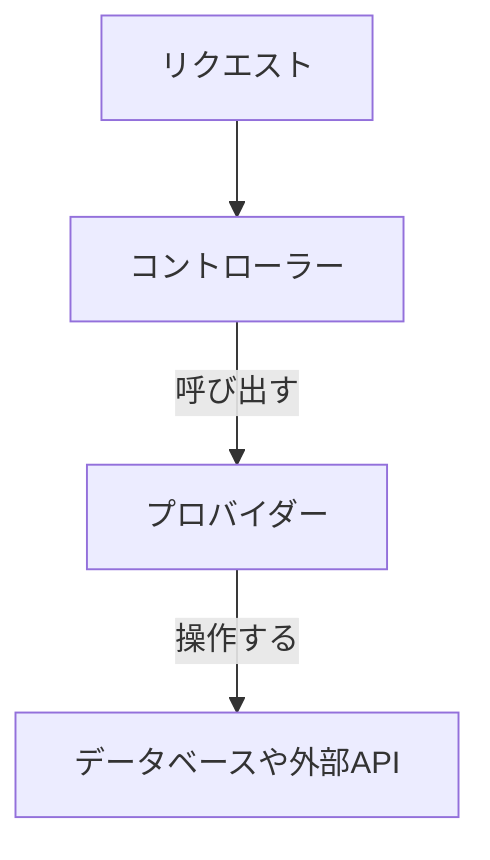

# 第02章 基本構造

NestJS アプリは以下の 3 つを中心に構成されます。

- **モジュール（Modules）** → アプリのまとまり
- **コントローラー（Controllers）** → HTTP リクエストの入口
- **プロバイダー（Providers）** → ビジネスロジックを実装するサービス層

さらに、これらを結びつけるのが **依存性注入（Dependency Injection, DI）** です。

------

### 2.1 モジュール（Modules）

- NestJS アプリはすべて **モジュール単位**で構成される。
- `@Module()` デコレーターを使い、以下を定義する：
  - `imports`: 他モジュールの読み込み
  - `controllers`: このモジュールが管理するコントローラー
  - `providers`: このモジュールで使うサービス（プロバイダー）
  - `exports`: 他モジュールから利用可能にするプロバイダー

📌 例：`AppModule`

```ts
import { Module } from '@nestjs/common';
import { AppController } from './app.controller';
import { AppService } from './app.service';

@Module({
  imports: [],
  controllers: [AppController],
  providers: [AppService],
})
export class AppModule {}
```

------

### 2.2 コントローラー（Controllers）

- 役割：**HTTP リクエストを受け取り、レスポンスを返す**
- デコレーター：
  - `@Controller('path')` → エンドポイントを定義
  - `@Get()`, `@Post()`, `@Put()`, `@Delete()` → HTTP メソッドに対応
- コントローラーは **サービス層（プロバイダー）を呼び出すだけ**にするのがベストプラクティス。

📌 例：

```ts
import { Controller, Get } from '@nestjs/common';
import { AppService } from './app.service';

@Controller('hello')
export class AppController {
  constructor(private readonly appService: AppService) {}

  @Get()
  getHello(): string {
    return this.appService.getHello();
  }
}
```

➡️ `http://localhost:3000/hello` にアクセスすると `"Hello World!"` が返る。

------

### 2.3 プロバイダー（Providers）

- 役割：**ビジネスロジックやデータ操作を担当**
- `@Injectable()` デコレーターで宣言。
- コントローラーや他のサービスに **依存性注入（DI）** で渡される。

📌 例：

```ts
import { Injectable } from '@nestjs/common';

@Injectable()
export class AppService {
  getHello(): string {
    return 'Hello World!';
  }
}
```

------

### 2.4 依存性注入（Dependency Injection, DI）

- NestJS の中核機能。
- `constructor(private readonly appService: AppService)` のように書くと、NestJS が自動的に `AppService` のインスタンスを作り、注入してくれる。
- 利点：
  - クラス間の依存を NestJS が解決 → 疎結合
  - テストしやすい（モックに差し替え可能）

📌 図解イメージ：



------

### 2.5 まとめ

- **モジュール**：アプリを構成する単位
- **コントローラー**：リクエストを受ける入口
- **プロバイダー**：ロジックを担当するサービス層
- **DI** により、クラス間の依存関係を NestJS が解決