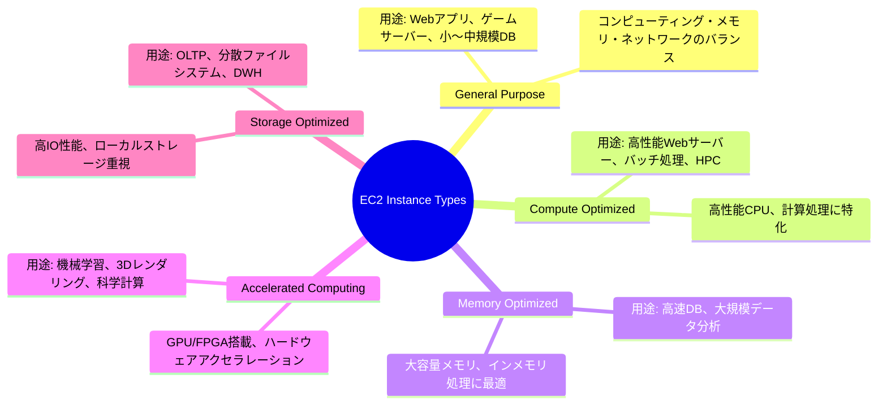
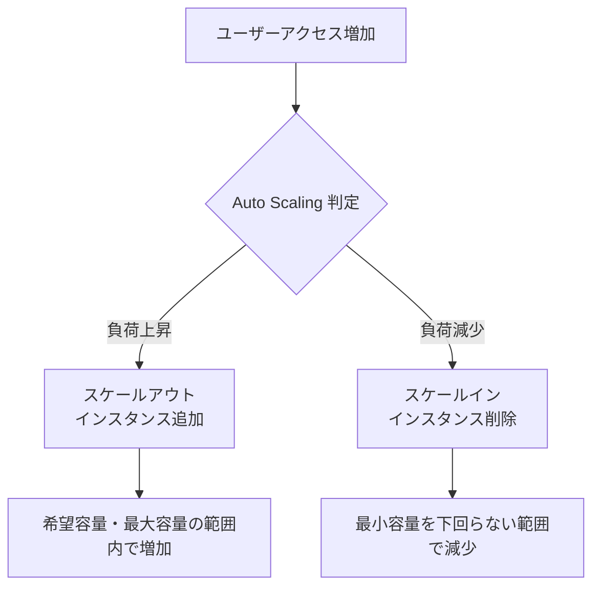
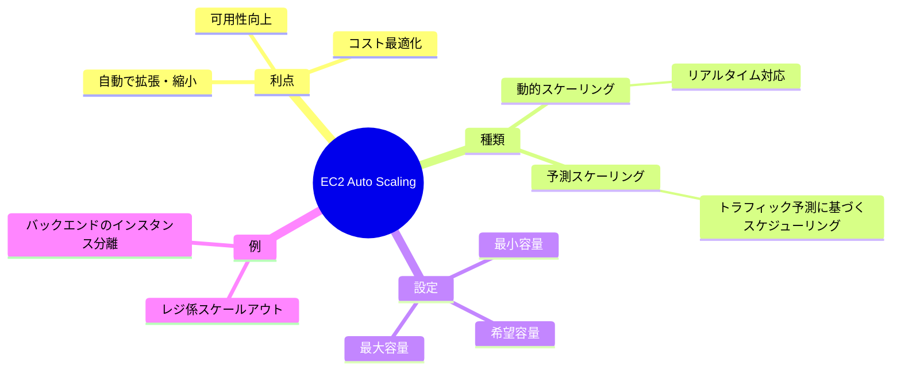
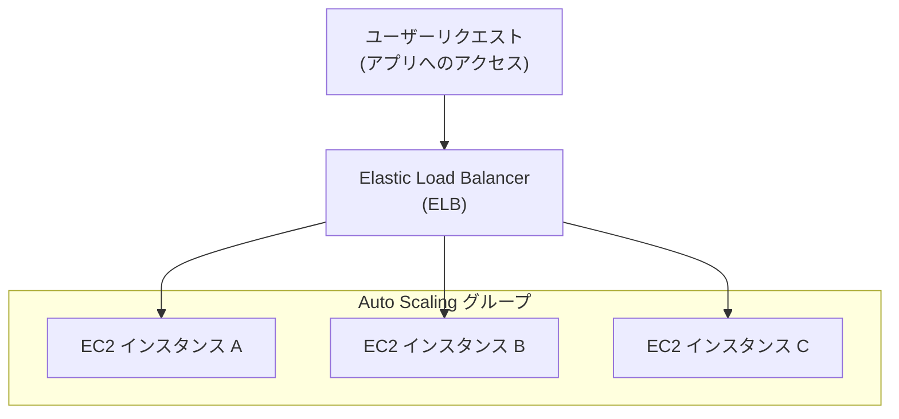
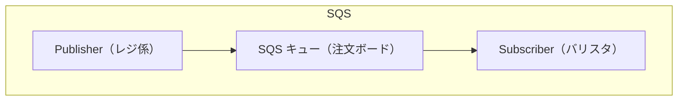
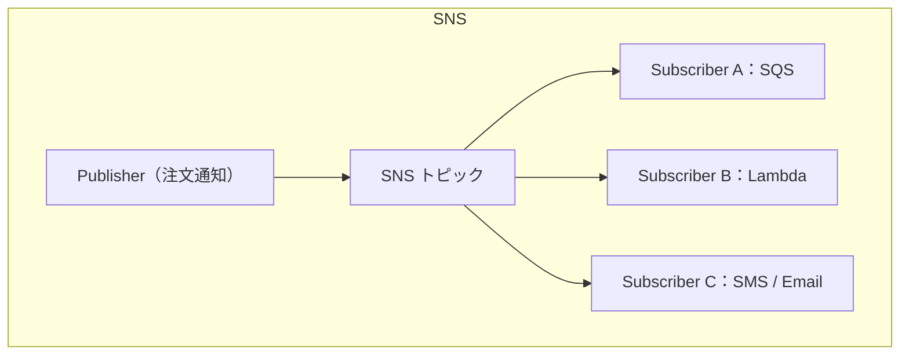
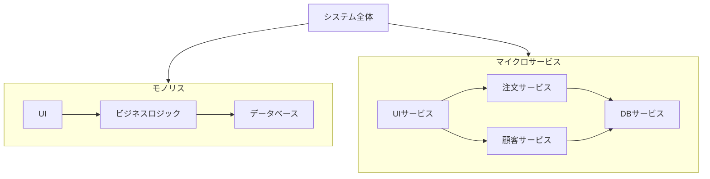

# Amazon EC2 と AWSのコンピューティングサービスの基礎

### 🎯 学習目標（Learning Objectives）

1. **Amazon EC2の利点**
    
    - オンデマンドで仮想サーバーを起動できる
        
    - 柔軟性が高く、迅速に利用開始できる
        
    - 従量課金制でコスト効率が良い
        
2. **インスタンスタイプの理解**
    
    - 汎用（General Purpose）
        
    - コンピューティング最適化（Compute Optimized）
        
    - メモリ最適化（Memory Optimized）
        
    - ストレージ最適化など
        
3. **請求オプションの違い**
    
    - オンデマンドインスタンス：柔軟性重視、短期利用向け
        
    - リザーブドインスタンス：長期利用でコスト削減
        
    - スポットインスタンス：安価だが中断の可能性あり
        
4. **EC2 Auto Scaling の利点**
    
    - トラフィック量に応じて自動でスケーリング
        
    - 高可用性とコスト効率の両立
        
5. **Elastic Load Balancing（ELB）の利点**
    
    - トラフィックを複数インスタンスに自動で分散
        
    - アプリケーションの安定稼働を支援
        
6. **ELB の使用例**
    
    - ウェブサイトへのアクセス分散
        
    - 負荷の高いアプリケーションの処理分散
        
7. **SNS と SQS の違い**
    
    - SNS：**Pub/Sub モデル**。同時に複数の購読者に通知を送信
        
    - SQS：**キュー モデル**。メッセージを順番に処理
        
8. **他のコンピューティングオプション**
    
    - AWS Lambda（サーバーレス）
        
    - AWS Fargate（コンテナの管理不要）
        
    - AWS Elastic Beanstalk（フルマネージド型のアプリ展開）
        

---

### 💡重要キーワードまとめ

|用語|説明|
|---|---|
|EC2|仮想サーバー。Elastic Compute Cloud の略|
|Auto Scaling|インスタンスの自動起動/停止で負荷に対応|
|ELB|複数インスタンス間での負荷分散|
|SNS|メッセージを複数サブスクライバーに送信|
|SQS|メッセージを順番に処理（非同期キュー）|

- Amazon EC2 のインスタンスタイプと料金オプション
- Amazon EC2 Auto Scaling
- Elastic Load Balancing
- メッセージング、コンテナ、サーバーレスコンピューティング向けの AWS のサービス

---

## 🖥️ EC2 インスタンスタイプの分類

### 🔹 汎用インスタンス（General Purpose）

- **特徴**：バランス型（CPU / メモリ / ネットワーク）
    
- **用途例**：Webサーバー、ゲームサーバー、中小規模のDB
    

### 🔹 コンピューティング最適化（Compute Optimized）

- **特徴**：高性能CPU、計算処理に最適
    
- **用途例**：ゲームエンジン、HPC、バッチ処理
    

### 🔹 メモリ最適化（Memory Optimized）

- **特徴**：大容量メモリ、高速インメモリ処理
    
- **用途例**：データ分析、インメモリDB、非構造化データ処理
    

### 🔹 高速コンピューティング（Accelerated Computing）

- **特徴**：GPU/FPGA によるアクセラレーション
    
- **用途例**：機械学習、3Dレンダリング、動画配信
    

### 🔹 ストレージ最適化（Storage Optimized）

- **特徴**：高IOPS、ローカルストレージ最適化
    
- **用途例**：DWH、分散ファイルシステム、OLTP

### 💡まとめ

- **選定基準**は、CPUかメモリか、ストレージIOか、GPUか、**何がボトルネックか**を見極めること。
- 必要に応じて**垂直スケーリング**（インスタンスのサイズ変更）や**水平スケーリング**（インスタンス数の増減）も可能。
- 使いすぎず、足りなすぎず、適切なタイプ選択が**コスト効率とパフォーマンスの鍵**。

| インスタンスカテゴリ       | 主な特徴                        | 代表的なユースケース                | たとえ話（コーヒーショップ）       |
| ---------------- | --------------------------- | ------------------------- | -------------------- |
| **汎用**           | CPU・メモリ・ネットワークのバランスが良い      | Webサーバー、ゲームサーバー、中小DBなど    | レジ係：バランスよく対応         |
| **コンピューティング最適化** | 高性能CPU。演算処理に強い              | 高負荷アプリ、ゲームエンジン、バッチ処理      | バリスタ：大量注文を素早く処理      |
| **メモリ最適化**       | メモリ容量が多く、高速アクセス可能           | 大規模DB、リアルタイム処理            | レジ係：大量メニューの処理を記憶して対応 |
| **高速コンピューティング**  | GPUやFPGAなどのハードウェアアクセラレーター搭載 | 機械学習、3Dレンダリング、科学技術計算      | ラテアート担当：特殊技能が必要な処理   |
| **ストレージ最適化**     | 高IOPS性能。ローカル高速ストレージ         | OLTP、データウェアハウス、分散ファイルシステム | 倉庫係：データを素早く出し入れ      |

---

## 💰 EC2 料金オプションの比較

### オンデマンド
### リザーブド
### Savings Plans
### スポット
### 専用ホスト

| オプション         | 特徴              | 割引率   | 適したケース           |
| ------------- | --------------- | ----- | ---------------- |
| オンデマンド        | 短期・不定期。契約・前払いなし | 0%    | 開発/テスト、本番前の検証    |
| リザーブド         | 1〜3年契約。使用タイプ固定  | 最大75% | 安定稼働が前提の本番環境     |
| Savings Plans | 時間単位でコミット。種類柔軟  | 最大72% | 汎用的なコスト最適化       |
| スポット          | 余剰リソース活用。中断あり   | 最大90% | バッチ処理、非緊急処理      |
| 専用ホスト         | 物理サーバーを専有       | —     | ライセンス制約、セキュリティ要件 |

 🧠 選び方のヒント

- **コスト重視**：Savings Plans > リザーブド > スポット（中断可なら）
    
- **安定性重視**：リザーブド or オンデマンド
    
- **柔軟性重視**：オンデマンド or コンバーティブルリザーブド
    
- **規制対応**：専用ホスト
    

---

## ☁️ EC2 Auto Scaling とスケーラビリティ（拡張性）の理解

### 🧠 基本概念：スケーラビリティと伸縮性

- **スケーラビリティ（Scalability）**：
    
    - システムがリソースを**自動で増減**できる能力
        
    - 「必要なときだけ使い、不要なときは削減」
        
- **オンプレミスの課題**：
    
    - ピークに合わせて購入 → 大半の時間アイドル状態
        
    - 平均使用量に合わせて購入 → ピークで対応不可
        
- **AWS の解決策**：
    
    - 実際の需要に応じてリソースを**自動調整**
        
    - ビジネスと財務の両面にメリットあり
        

---

### 🏪 コーヒーショップの例（比喩）

| 登場人物/役割 | EC2の構成要素            | 説明                    |
| ------- | ------------------- | --------------------- |
| 生出さん    | フロントエンドの EC2 インスタンス | 顧客の注文を受ける係（スケールアウト対象） |
| ドリンク係   | バックエンドの EC2 インスタンス  | 処理能力が高いが冗長化必要         |
| レジの列    | トラフィックの増加           | 顧客の増減に応じてリソースの調整が必要   |

---

### 🔄 EC2 Auto Scaling の仕組み

#### 📌 役割

- EC2 インスタンスを**需要に応じて自動的に追加（スケールアウト）・削除（スケールイン）**
    
- アプリケーションの可用性とコスト効率を両立
    

#### ⚙️ 2 種類のスケーリング

|タイプ|特徴|
|---|---|
|**動的スケーリング**|トラフィックの変動にリアルタイムで反応して調整|
|**予測スケーリング**|過去の傾向から未来のトラフィックを予測し、事前に調整|

---

### 📐 Auto Scaling グループの設定項目

|設定項目|説明|
|---|---|
|**最小容量（Min）**|常に稼働させる最低限のインスタンス数（例：1）|
|**希望容量（Desired）**|通常時に稼働させるインスタンス数（例：2）|
|**最大容量（Max）**|スケールアウト時の上限（例：4）|

#### スケーリングの流れと構成

#### スケーラビリティ全体像

### 💡 実用ポイント

- **スケーリングの粒度**：レジ係（フロント）とドリンク係（バックエンド）を**分離・個別にスケーリング**
    
- **過剰なプロビジョニングの回避**：常に必要な分だけを確保
    
- **アーキテクチャの疎結合化**がスケーラビリティ設計の鍵
    

---

### ✅ メリットまとめ

- **パフォーマンスの最適化**：リクエスト過多によるタイムアウト回避
    
- **コストの最適化**：アイドル時のインスタンスは停止
    
- **ビジネス拡大にも柔軟対応**：トラフィック変動に対応可能な体制

---

## 🔄 Elastic Load Balancing（ELB）

📌 **Elastic Load Balancing (ELB)** は、受信アプリケーショントラフィックを複数のターゲット（Amazon EC2 インスタンスなど）に**自動的に分散**する AWS のサービスです。

- **単一の接続先**として機能し、トラフィックを複数のリソースへ分配
    
- **Auto Scaling** と連携することで、パフォーマンスと可用性の両立が可能
    

### 🏪 コーヒーショップの例え

|要素|現実の構成|例え|
|---|---|---|
|EC2 インスタンス|レジカウンター|顧客の注文を処理|
|ELB|店の案内係|各レジに均等にお客様を案内|
|トラフィック|お客様の来店|処理量の変化に対応|

- **低需要時**：レジが少なくても対応可能
    
- **高需要時**：レジを増やし、ELBが負荷を均等に割り当て
    

---

### 🧩 ELB の仕組みと連携

- ELB は Auto Scaling グループの **前面に配置**される
    
- **受信リクエストはまず ELB に到達** → 利用可能なインスタンスへルーティング
    
- これにより、
    
    - 特定の EC2 インスタンスに負荷集中しない
        
    - スムーズなスケールイン・スケールアウトが実現
        

---

### 🔧 ELB の種類（補足）

※詳細は後の学習で扱う

| 種類                              | 用途                      |
| ------------------------------- | ----------------------- |
| Application Load Balancer (ALB) | HTTP/HTTPS レベル（レイヤー7）   |
| Network Load Balancer (NLB)     | 高パフォーマンス TCP/UDP（レイヤー4） |
| Gateway Load Balancer (GWLB)    | セキュリティアプライアンス向け         |
|                                 |                         |

---

### ✅ メリット

- 高可用性（可用なインスタンスへ自動ルーティング）
    
- 高スケーラビリティ（Auto Scaling とシームレスに連携）
    
- 耐障害性の向上（単一障害点の排除）
    

以下は、**Amazon SNS・SQS を中心としたメッセージングとキューイングの概念**をまとめた Markdown 学習ノードです。コーヒーショップの例を活かしながら、密結合 vs 疎結合、Pub/Sub モデルの理解を深める構成にしています。

---

## ✉️ メッセージングとキューイング（Amazon SNS / SQS）

### ☕ 背景：コーヒーショップの例え

|要素|役割|AWS 対応サービス|
|---|---|---|
|レジ係|注文を受ける人|メッセージの発行（Publisher）|
|バリスタ|ドリンクを作る人|メッセージの受信（Subscriber）|
|注文票|メッセージデータ|SQS キュー / SNS トピック|
|注文ボード|中継地点・バッファ|SQS キュー|
|通知音|メッセージの通知機能|SNS 通知（SMS / Email）|

---

### 🔗 密結合 vs 疎結合アーキテクチャ

|区分|特徴|
|---|---|
|密結合|- 直接依存関係あり- 一方がダウンすると全体に影響|
|疎結合|- 中間にバッファ（キュー）を設置- 独立性が高く信頼性◎|

 🧩 疎結合の仕組み

- アプリBが一時的に停止していても、メッセージはキューに蓄積され、後で処理可能。
    

---

### 📬 Amazon SQS：メッセージキューイングサービス

- メッセージを送信・保存・受信するバッファ
    
- フルマネージド・スケーラブル・信頼性◎
    
- メッセージ内容：**ペイロード（Payload）**
    

### 🔄 処理の流れ

1. アプリAがキューにメッセージ送信
    
2. アプリBがキューからメッセージ取得し処理
    
3. 処理後にキューから削除
    

**メッセージキューイング**

---

### 📢 Amazon SNS：通知サービス（Pub/Subモデル）

- トピックを作成 → 複数サブスクライバーに通知
    
- 一斉配信型：**1回の送信で全サブスクライバーに配信**
    
- 配信先例：
    
    - SQS キュー
        
    - Lambda 関数
        
    - HTTPS エンドポイント
        
    - SMS / Email / モバイル通知
        

**パブリッシュ/サブスクライブ**

---

### 🧠 モノリス vs マイクロサービス

| モデル      | 特徴                     |
| -------- | ---------------------- |
| モノリス     | コンポーネントが密結合、一部障害で全体に影響 |
| マイクロサービス | 疎結合、障害が限定され全体は維持可能     |

| 項目      | モノリス                 | マイクロサービス                 |
| ------- | -------------------- | ------------------------ |
| 構成      | すべての機能が1つのアプリに統合     | 各機能が独立した小さなサービスで構成       |
| 障害の影響範囲 | 1つの障害が全体に影響を与えやすい    | 他のサービスに影響を与えず一部のみ切り分け可能  |
| デプロイ    | 全体を一括でビルド・デプロイが必要    | 個別にスケーリング・デプロイ可能         |
| 開発・運用   | 単一チームで管理しやすいが柔軟性に欠ける | サービスごとにチーム分担・柔軟だが複雑化しやすい |

- **SNS/SQS を使うことでマイクロサービス間の連携が容易に**
    

---

### ✅ まとめ

- **SQS**：キューを使って非同期処理、遅延許容性、信頼性UP
    
- **SNS**：イベント駆動通知の実現、リアルタイム性の強化
    
- 密結合を避け、疎結合でシステムの**可用性・柔軟性**を高める
    
- アーキテクチャ設計の基本 → **バッファ & メッセージング**

## ⚙️ AWS コンピューティングサービスまとめ

### 🧭 1. コンピューティング方式の分類

|分類|特徴|代表サービス|
|---|---|---|
|仮想マシン型|インスタンスを自分で管理（プロビジョニング・スケール等）|Amazon EC2|
|コンテナ型|軽量な仮想化（コードと依存をパッケージ）|ECS / EKS / Fargate|
|サーバーレス|インフラ管理不要。コード単位で自動実行|AWS Lambda|

---

### 🖥️ 2. Amazon EC2（仮想マシン）

- 仮想サーバーをプロビジョニングして使用
    
- OS・パッチ・スケール管理も必要（オンプレミスよりは簡単）
    
- 柔軟性・信頼性・スケーラビリティあり
    
- **向いている用途**：
    
    - フル制御が必要なアプリ
        
    - 長時間実行する処理や常時起動のサービス
        

---

### ⚡ 3. AWS Lambda（サーバーレス関数）

- **イベント駆動型**：イベント発生時に関数が自動実行
    
- 最大実行時間：**15分**
    
- 自動スケール、従量課金制（実行時間のみ課金）
    
- **向いている用途**：
    
    - API バックエンド、画像変換、ファイルアップロード処理
        
    - 軽量で即時応答が必要な処理
        

---
### 🔁 4. Fargate（サーバーレスコンテナ）

- **EC2 を使わずコンテナを実行**
    
- ECS / EKS と連携して動作
    
- 実行に必要なリソース分だけ課金
    
- 運用管理ゼロ、アプリ開発に専念可
    

### 📦 5. コンテナ & オーケストレーション

#### 🧱 コンテナとは？

- アプリケーション＋依存関係＋構成情報をパッケージ化
    
- Docker コンテナとして稼働
    
- 軽量・高速起動・移植性に優れる
    

#### 🧭 管理手段（2種類）

| サービス           | 特徴                       |
| -------------- | ------------------------ |
| **Amazon ECS** | AWS 独自のコンテナ管理ツール。簡単、軽量。  |
| **Amazon EKS** | Kubernetes ベース。柔軟・拡張性あり。 |

#### 🚀 実行プラットフォーム（2択）

| 実行方式        | 特徴                 |
| ----------- | ------------------ |
| **EC2**     | 自分でホスト（インフラ管理あり）   |
| **Fargate** | AWS がホスト（インフラ完全自動） |

#### ✅ 実行プラットフォームとは？

> **実行プラットフォーム**とは、アプリケーションやコンテナを「どこで・どのように」実行するかを決める土台（実行環境）のことです。

AWS のコンテナサービス（ECS / EKS）を使うときには、**コンテナをどのプラットフォーム上で実行するか**を選ぶ必要があります。その選択肢が次の2つです：

---

##### 🧱 1. **EC2 実行タイプ**

- コンテナは **自分で起動した EC2 インスタンス上**で動く
    
- サーバー（仮想マシン）のプロビジョニング・管理が必要
    
- メリット：
    
    - OS やネットワークを細かく制御できる
        
    - カスタム AMI やストレージ構成を使える
        
- デメリット：
    
    - スケーリング・パッチなどのインフラ管理が発生する
        

---

##### ☁️ 2. **Fargate 実行タイプ**

- コンテナは **AWS が管理するインフラ上**で動く
    
- EC2 を使わずにコンテナだけを定義すればOK
    
- メリット：
    
    - サーバー管理・パッチ・スケール調整がすべて自動
        
    - 実行時間・リソースに応じた従量課金
        
- デメリット：
    
    - OS やネットワーク設定の細かい制御は不可
        
    - サービスによっては制限がある（例：一部の GPU 利用）
        

---

#### 🎯 比較イメージ

|項目|EC2 実行タイプ|Fargate 実行タイプ|
|---|---|---|
|インフラ管理|自分で行う|AWS が全自動で実行|
|柔軟性（カスタム性）|高い（細かく制御可能）|低い（シンプルで手軽）|
|起動までの準備|EC2の設定・AMIsなど|コンテナ定義だけでOK|
|適した用途|カスタム環境、長時間稼働|短期処理、シンプルな構成|

- **自由度と制御性を求めるなら EC2 実行**
    
- **運用を最小化して効率重視なら Fargate**

---

### 📊 6. まとめ：選び方ガイド

|要件|推奨サービス|
|---|---|
|OSレベルの制御、長期実行処理|Amazon EC2|
|軽量なイベント駆動、インフラ管理不要|AWS Lambda|
|移植性・軽量性、Docker利用|ECS / EKS + EC2 or Fargate|
|Kubernetesベースで拡張性が必要|Amazon EKS + Fargate|
|オーケストレーション不要の単機能関数型|AWS Lambda|
## 🔗 その他のリソース

- [AWS でのコンピューティング](https://aws.amazon.com/products/compute)
- [AWS Compute ブログ](https://aws.amazon.com/blogs/compute/)
- [AWS Compute Services](https://docs.aws.amazon.com/whitepapers/latest/aws-overview/compute-services.html)
- [ハンズオンチュートリアル: コンピューティング](https://aws.amazon.com/getting-started/hands-on/?awsf.getting-started-category=category%23compute&awsf.getting-started-content-type=content-type%23hands-on)
- [カテゴリ別のディープダイブ: サーバーレス](https://aws.amazon.com/getting-started/deep-dive-serverless/)
- [AWS のお客様事例: サーバーレス](https://aws.amazon.com/solutions/case-studies/?customer-references-cards.sort-by=item.additionalFields.publishedDate&customer-references-cards.sort-order=desc&awsf.customer-references-location=*all&awsf.customer-references-segment=*all&awsf.customer-references-product=product%23vpc%7Cproduct%23api-gateway%7Cproduct%23cloudfront%7Cproduct%23route53%7Cproduct%23directconnect%7Cproduct%23elb&awsf.customer-references-category=category%23serverless)
- [Amazon EC2 リザーブドインスタンス](https://docs.aws.amazon.com/AWSEC2/latest/UserGuide/ec2-reserved-instances.html)
- [Savings Plans が使用量に適用される仕組み](https://docs.aws.amazon.com/savingsplans/latest/userguide/sp-applying.html)
