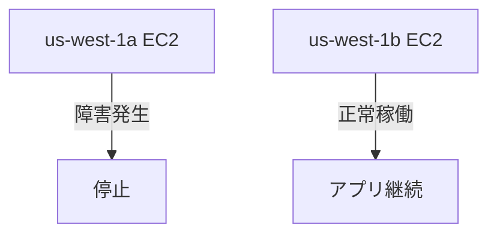

# AWS グローバルインフラストラクチャ

> - AWS リージョンとアベイラビリティーゾーン
>- エッジロケーションと Amazon CloudFront
>- AWS マネジメントコンソール、AWS CLI、SDK
>- AWS Elastic Beanstalk
>- AWS CloudFormation

### 🎯 学習目標

- AWS グローバルインフラストラクチャの利点を説明
    
- アベイラビリティーゾーン (AZ) の概念を理解
    
- CloudFront とエッジロケーションの利点を理解
    
- AWS サービスのプロビジョニング方法を比較

---

### 🌐 AWS グローバルインフラストラクチャの特徴

|用語|説明|
|---|---|
|**リージョン**|地理的に分離された複数のデータセンターグループ（例：東京、フランクフルト）|
|**アベイラビリティーゾーン（AZ）**|同一リージョン内の独立したデータセンターまたはグループ。数十マイルの距離に配置|
|**エッジロケーション**|ユーザーに最も近い場所にキャッシュされたコンテンツを配信（CloudFrontによるCDN機能）|

---

### 🏪 高可用性の例え：コーヒーショップ

- 店舗前のパレードにより一時閉店 → 別の店舗で対応可能（= 複数AZの冗長性）
    
- AWSの仕組みも同様で、災害や障害があっても別AZで運用を継続可能
    

---

### ✅ リージョン選定の4つの要素

|要素|内容|
|---|---|
|1. **コンプライアンス**|国や地域ごとの法的要件（例：EU圏でのデータ保存）|
|2. **近接性**|顧客に近いリージョンほどレイテンシーが低く有利|
|3. **機能の可用性**|一部サービスは特定のリージョンでのみ提供（例：Amazon Braket）|
|4. **料金**|リージョンごとにコストが異なる（例：サンパウロはオレゴンより高い）|

---

### 🧱 アベイラビリティーゾーン（AZ）

- 各AZは **冗長な電源、ネットワーク、接続性** を持つ
    
- リージョンには **最低2つ以上のAZ** が推奨
    
- 自然災害が起きても、他のAZでサービス継続可能
    



---

### 🚀 高可用性とレイテンシーの設計

- **同じリージョン内の複数AZ** にアプリケーションをデプロイ
    
- AZ間は低レイテンシーで通信可能
    
- **ELBやS3などのリージョンレベルのサービス** は、自動的に冗長化され高可用性を確保
    

---

### 🌍 CloudFrontとエッジロケーション

|用語|説明|
|---|---|
|**CloudFront**|AWSのコンテンツ配信ネットワーク（CDN）|
|**エッジロケーション**|ユーザーに最も近い場所に配置されたデータキャッシュ|

---

### 🛠 AWS サービスのプロビジョニング方法比較（概要）

|方法|特徴|
|---|---|
|オンデマンド|必要なときにすぐに使える|
|自動スケーリング|トラフィックに応じてスケール|
|マネージドサービス|AWSがインフラ管理を代行|

---

### 💡 ベストプラクティス

- リージョン選定は **コンプライアンス→近接性→機能→料金** の順で検討
    
- **少なくとも2つ以上のAZ** にデプロイ
    
- **リージョンレベルのサービス**（例：ELB, S3）を活用して高可用性を確保
    

以下は、**モジュール3：AWS グローバルインフラストラクチャ（後半）**の内容をまとめた **Markdown ノート** です。

---
## 📦 エッジロケーションと CDN

### 💡 概要

|用語|説明|
|---|---|
|**エッジロケーション**|世界中のユーザーの近くにデータをキャッシュして配置する場所。CloudFront が活用|
|**CDN (Content Delivery Network)**|ユーザーの近くにコンテンツをキャッシュして配信速度と可用性を向上させる仕組み|
|**Amazon CloudFront**|AWSのCDNサービス。データ・動画・API などを高速配信|
|**Amazon Route 53**|DNSサービス。グローバルな名前解決と低レイテンシールーティングに対応|

### ☕ 例え話

- 本店ではなく **サテライト店**（= エッジロケーション）を配置して顧客に近いところでサービスを提供
    

---

## 🖥 AWSの操作方法（リソースプロビジョニング）

### 🔧 操作手段一覧

|操作手段|特徴|用途・利点|
|---|---|---|
|**AWS マネジメントコンソール**|GUI操作、初心者向け|学習、テスト環境構築に最適|
|**AWS CLI**|コマンド操作、スクリプト化可|作業の自動化、再現性向上|
|**AWS SDK**|各種言語対応のAPI|プログラムからAWSを操作（Java, Python など）|
|**AWS Elastic Beanstalk**|環境自動構築（PaaS）|アプリ開発者向けの簡易デプロイ環境|
|**AWS CloudFormation**|Infrastructure as Code (IaC)|コードベースで自動・再現可能な環境構築|

---

### 📊 操作方法の比較表

|ツール|自動化|GUI|再利用性|使用例|
|---|---|---|---|---|
|マネジメントコンソール|✖|✅|✖|初学者・設定確認|
|CLI|✅|✖|✅|バッチ処理・自動化|
|SDK|✅|✖|✅|アプリ組込み|
|Beanstalk|✅|△|✅|Webアプリ展開|
|CloudFormation|✅|✖|✅|IaC・本番運用|

---

## 🧰 Elastic Beanstalk vs CloudFormation

|項目|Elastic Beanstalk|CloudFormation|
|---|---|---|
|用途|Webアプリの迅速デプロイ|複雑な環境のIaC|
|管理単位|アプリケーション単位|インフラ構成単位（スタック）|
|UI|GUIあり|YAML/JSONファイルで定義|
|自由度|中程度（AWSが管理）|高（すべて自分で定義）|
|対象|初中級者|中上級者（DevOps/本番運用）|

 🎯 どちらも「AWSの環境を自動で作る」ツールですが、用途が違います。

|比較項目|Elastic Beanstalk|CloudFormation|
|---|---|---|
|🧩 主な目的|アプリを**すぐに公開・運用**したい|**インフラ全体をコードで管理**したい|
|👨‍💻 ユーザー対象|初心者〜中級者向け|中級者〜上級者（DevOps 向け）|
|⚙️ 管理内容|AWS が多く自動設定|ユーザーが細かく設計|
|🔁 再利用性|設定を保存・再展開可能|テンプレートで何度でも環境構築可|
|🧰 主な使い方|アプリのコードと設定を渡すだけ|JSON/YAML で構成を細かく定義|
|🎨 カスタマイズ|あまり自由度はない（簡単）|非常に自由・細かい制御可能|
|🔄 スタック管理|単一アプリの環境|複数リソースの統合管理|
|🧠 学習コスト|低|中〜高（IaCの理解が必要）|

---

### 🍃 Elastic Beanstalk の具体例

> ✅ **使いたい人**：  
> 「Pythonで作ったWebアプリを、すぐAWSで動かしたい」


**💡 できること**

- アプリをアップロードするだけで…
    
    - EC2、RDS、ELBなどを**自動で構築**
        
    - スケーリング・モニタリングも自動で対応
        
    - 環境の更新もGUIで簡単！
        

```plaintext
例：
1. Python アプリのコードをzipにする
2. Elastic Beanstalk の画面でアップロード
3. 数分でアプリが動く環境が完成（EC2＋ELB＋Auto Scalingなど）
```

---

### 🧱 CloudFormation の具体例

> ✅ **使いたい人**：  
> 「本番環境と全く同じ構成を、他のリージョンにも自動で作りたい」

**💡 できること**

- 複雑な構成を**コード（YAML/JSON）で完全再現**
    
- バージョン管理・自動デプロイに最適
    
- CI/CD やチーム開発向け
    

```yaml
例：S3 + Lambda + DynamoDB の構成を YAML で定義
Resources:
  MyBucket:
    Type: AWS::S3::Bucket
  MyFunction:
    Type: AWS::Lambda::Function
  MyTable:
    Type: AWS::DynamoDB::Table
```

このテンプレートを何度でも使って、**まったく同じ環境**を複数の場所に作れる。

---

### 📝 どちらを使うべき？

|シチュエーション|おすすめ|
|---|---|
|早くアプリを公開したい|🌱 **Elastic Beanstalk**|
|インフラをコード化・自動化したい|🧱 **CloudFormation**|
|DevOps/CDパイプラインを整備したい|🧱 **CloudFormation**|
|アプリだけ触りたい、設定はお任せしたい|🌱 **Elastic Beanstalk**|

---

必要があれば「どっちを使えばいいか判断するフローチャート」や、「CloudFormation テンプレートの具体例」も作成できますよ！

---

## 📌 まとめ

### グローバルインフラの利点と操作性

1. **リージョン**：地理的に分離された場所（コンプライアンス・可用性確保）
    
2. **AZ**：数十マイル離れたデータセンター群（高可用性・耐障害性）
    
3. **エッジロケーション**：CDNで低レイテンシーと高速配信
    
4. **APIベースの操作**：コンソール、CLI、SDK、IaC（CloudFormation）などニーズに応じて選択

### その他のリソース

- [グローバルインフラストラクチャ](https://aws.amazon.com/about-aws/global-infrastructure/)
- [AWS グローバルインフラストラクチャのインタラクティブマップ](https://www.infrastructure.aws/)
- [リージョンとアベイラビリティーゾーン](https://aws.amazon.com/about-aws/global-infrastructure/regions_az)
- [AWS のネットワークとコンテンツ配信のブログ](https://aws.amazon.com/blogs/networking-and-content-delivery/)
- [AWS での構築ツール](https://aws.amazon.com/tools/)
- [AWS のお客様事例: コンテンツ配信](https://aws.amazon.com/solutions/case-studies/?customer-references-cards.sort-by=item.additionalFields.publishedDate&customer-references-cards.sort-order=desc&awsf.customer-references-location=*all&awsf.customer-references-segment=*all&awsf.customer-references-product=product%23vpc%7Cproduct%23api-gateway%7Cproduct%23cloudfront%7Cproduct%23route53%7Cproduct%23directconnect%7Cproduct%23elb&awsf.customer-references-category=category%23content-delivery)