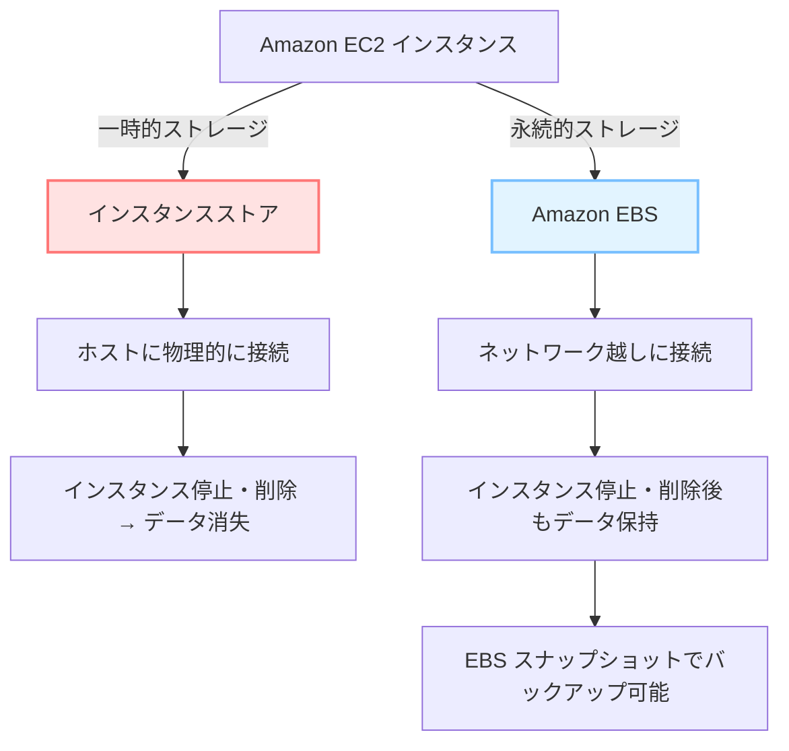

# ✅ ストレージとデータベース

## 🎯**学習目標（Learning Objectives）**

- ストレージとデータベースの基本概念の理解
- 各AWSサービスの利点を把握
  - **Amazon EBS**（ブロックストレージ）
  - **Amazon S3**（オブジェクトストレージ）
  - **Amazon EFS**（ファイルストレージ）
  - **Amazon RDS**（リレーショナルデータベース）
  - **Amazon DynamoDB**（NoSQLデータベース）
- ストレージとデータベースの各種ソリューションの違いと使い分け

---
### ☕ **コーヒーショップのシナリオ**

**なぜデータベースとストレージが必要？**あるコーヒーショップの例を用いて、AWSのデータ管理の重要性を示します：

- ビジネスは成功しており、アーキテクチャは既に柔軟で信頼性が高い。
- 今後の課題は **顧客ロイヤルティプログラム** を導入し、顧客に感謝を示すこと。
- 紙のスタンプカードでは限界があるため、**デジタルカード**の導入を検討。
- 顧客の注文履歴や支出情報を記録し、より良いサービス提供に役立てる。

→ ここで必要になるのが「**ストレージとデータベースの選定**」。

------

🧠 **ポイント**

- すべてのデータベースやストレージが万能なわけではない。
- **データの種類・目的・要件に応じて最適なサービスを選ぶ** ことが重要。
- AWSでは、ユースケースごとに使い分けられる豊富なサービスが用意されている。

------

## 🧱 インスタンスストア vs. Amazon EBS（Elastic Block Store）

### 🔹 インスタンスストア（Instance Store）

- **物理ホストに直結**された一時的なローカルストレージ
- **EC2インスタンスの停止・終了と同時にデータも削除**
- データの**永続性なし**
- **再作成時は別ホストになる可能性 → データは復元不可**
- 📌**用途例**：一時ファイル、キャッシュ、スクラッチデータ

🔁 **ライフサイクル例**

```
ステップ1：EC2 インスタンス起動 → インスタンスストア利用可能  
ステップ2：インスタンス停止または終了  
ステップ3：インスタンスストア内のデータは削除される
```

------

### 🔸 Amazon Elastic Block Store（Amazon EBS）

- **ネットワーク経由**でEC2インスタンスにアタッチされる**永続的ストレージ**
- インスタンスの**停止・終了に関係なくデータは保持**
- 仮想ハードディスクのように扱える（ボリュームサイズ・タイプ選択可）
- 複数インスタンス間での切り替えやスナップショットによる**バックアップ・復元**が可能
- 📌**用途例**：データベース、アプリケーションデータ、ログファイル など

### 🧩 スナップショットとは？

- **EBS ボリュームのバックアップ機能**
- **初回**はフルバックアップ
- 以降は **増分バックアップ**（変更分のみ保存）
- コスト削減と効率的なデータ保全が可能

🗓️ **増分バックアップの例**

- 1日目：2つのボリューム → フルバックアップ
- 2日目：1つ追加 → 新しい1つのみバックアップ
- 3日目：2つ追加 → その2つのみバックアップ


💾 **EBS スナップショット - 増分バックアップの仕組み**


------

### ✅ まとめ：どちらを使うべき？

| 特徴     | インスタンスストア     | Amazon EBS                 |
| -------- | ---------------------- | -------------------------- |
| 永続性   | なし                   | あり                       |
| 高速性   | 非常に高速（ローカル） | 高速（ネットワーク越し）   |
| 耐障害性 | 低                     | 高（スナップショット対応） |
| 用途例   | 一時データ、キャッシュ | 本番データ、DB、ログなど   |

📊  **インスタンスストア vs. Amazon EBS** 



------

## ☁️ Amazon S3 ストレージ

Amazon S3（Simple Storage Service）は、データを**オブジェクトストレージ**として保存するフルマネージドサービスです。

### 📦 オブジェクトストレージの基本構造

- **オブジェクト = データ + メタデータ + キー**
  - データ：画像、文書、動画など
  - メタデータ：ファイルタイプ、作成日などの補足情報
  - キー：一意の識別子（パスの代替）
- 💡 ブロックストレージとの違い：
  - ブロック：部分更新可能
  - オブジェクト：**全体が更新される**

### 🗂️**ストレージクラス一覧**

S3には複数のストレージクラスがあり、**アクセス頻度・耐久性・コスト要件**に応じて選択できます。

### ✅ S3 Standard（標準）

- **用途**：最も一般的で、**頻繁にアクセスされるデータ**に最適。
- **耐久性**：99.999999999%（11ナイン）
- **可用性**：99.99%
- **保存場所**：少なくとも **3つのAZ（アベイラビリティゾーン）**に自動でレプリケーション。
- **代表ユースケース**：
  - ウェブサイトの画像、CSS、HTMLファイル
  - アクセスログ、日常的なドキュメント
  - データ分析のインプットファイル

------

### ✅ S3 Standard - IA（低頻度アクセス）

- **用途**：たまにしかアクセスしないが、必要なときはすぐに取り出したいデータ。
- **耐久性**：11ナイン
- **可用性**：99.9%
- **料金体系**：
  - 保存コストは低いが、**データ取得に課金**がある。
- **代表ユースケース**：
  - バックアップファイル
  - 災害復旧（DR）用データ
  - 古いメディアデータの保持

------

### ✅ S3 One Zone - IA（1ゾーン・低頻度アクセス）

- **用途**：**復元可能なデータ**で、コスト最重視のストレージ。
- **保存場所**：**単一のAZ**のみ（レプリカなし）
- **可用性**：99.5%
- **代表ユースケース**：
  - 一時的なコピーやローカルに再生成可能なデータ
  - 本番環境での使用は推奨されない

------

### ✅ S3 Intelligent-Tiering（インテリジェント階層化）

- **用途**：アクセスパターンが不明、または変動するデータに最適。
- **特徴**：
  - S3 が自動的にアクセスパターンを監視し、適切な階層へ移動。
  - 30日アクセスがなければ「低頻度階層」へ自動移動。
  - 月額わずかな**モニタリングコスト**が発生。
- **代表ユースケース**：
  - 長期保存データで、どの程度使われるかわからない場合
  - 分析ログなどの不定期アクセスデータ

------

### ✅ S3 Glacier Instant Retrieval

- **用途**：アーカイブ済みでも**すぐにアクセスが必要**なデータ。
- **取得速度**：**ミリ秒単位**（S3 Standardと同等）
- **コスト**：通常のGlacierより高いが、即時性が優先される場面に対応。
- **代表ユースケース**：
  - 古い医療記録、保険申請書類
  - 高頻度にはアクセスしないが、必要時に即取得する必要がある業務書類

------

### ✅ S3 Glacier Flexible Retrieval（旧称：Glacier）

- **用途**：アーカイブ目的のデータ。取得は少し遅れてOK。
- **取得速度**：1分～12時間（スピードにより料金異なる）
- **料金**：保存コストは非常に安価。取得は時間＆料金がかかる。
- **代表ユースケース**：
  - 規制対応の長期保管記録
  - メディアアーカイブ（古い映像・音声）

------

### ✅ S3 Glacier Deep Archive

- **用途**：**年に1〜2回程度しかアクセスしない**極低頻度のデータに。
- **取得速度**：12〜48時間
- **特徴**：**S3 最安ストレージクラス**
- **代表ユースケース**：
  - 税務・監査書類（7年間保存など）
  - 法的保存義務のある電子データ

------

### ✅ S3 Outposts

- **用途**：**オンプレミス環境で S3 を使いたい**場合。
- **実行環境**：AWS Outposts 上にローカルS3バケットを作成可能。
- **特徴**：
  - レイテンシに敏感なアプリケーションに最適
  - オフライン拠点や機密環境などでの利用

---

### 🔁 バージョニングとライフサイクル管理

- **バージョニング（Versioning）**：
  - ファイルの変更履歴を保持
  - 誤削除時の復元が可能
- **ライフサイクルポリシー**：
  - オブジェクトの保存期間に応じて自動的に階層移動
  - 例：
    - 90日 S3 Standard
    - 30日間 S3-IA
    - 以降 S3 Glacierへ移動（合計120日）

------

### 🧠 選定のポイント

- 📁 **バケット**：ファイル（＝オブジェクト）を保存する単位
- 📦 **オブジェクト**：データ本体 + メタデータ + キー（一意識別子）
- 🔁 **バージョニング**：過去バージョンの保存と復元が可能
- 🔐 **アクセス許可**：細かく制御できる（公開/限定/非公開など）
- 🔄 **ライフサイクルポリシー**：時間に応じて自動的に階層を移動

````mermaid
graph TB
  Root[S3 ストレージクラス]

  subgraph A[頻繁アクセス]
    A1[S3 Standard<br>高可用性・頻繁アクセス]
    A2[S3 Intelligent-Tiering<br>自動階層化]
  end

  subgraph B[低頻度アクセス]
    B1[S3 Standard-IA<br>3AZに保存]
    B2[S3 1ゾーン-IA<br>最安・単一AZ]
  end

  subgraph C[アーカイブ用途]
    C1[S3 Glacier Instant Retrieval<br>即時取得アーカイブ]
    C2[S3 Glacier Flexible Retrieval<br>1分〜12時間取得]
    C3[S3 Glacier Deep Archive<br>12〜48時間取得・最安]
  end

  subgraph D[オンプレミス対応]
    D1[S3 Outposts<br>オンプレ保存]
  end

  Root --> A
  Root --> B
  Root --> C
  Root --> D

````

| 比較項目                   | 頻度が高い | 頻度が低い | 長期保存 | オンプレ |
| -------------------------- | ---------- | ---------- | -------- | -------- |
| **S3 Standard**            | ◉          | △          | △        | ✕        |
| **S3-IA**                  | △          | ◉          | ○        | ✕        |
| **S3 1ゾーン-IA**          | △          | ◉（安）    | △        | ✕        |
| **S3 Intelligent-Tiering** | ○          | ○          | ○        | ✕        |
| **Glacier XXX**            | ✕          | △          | ◉        | ✕        |
| **S3 Outposts**            | ✕          | ✕          | △        | ◉        |

### 📌 **まとめ**

| ストレージクラス名                | 特徴                                                         | 主な用途                                 |
| --------------------------------- | ------------------------------------------------------------ | ---------------------------------------- |
| **S3 Standard**                   | 高頻度アクセス用耐久性99.999999999%（11ナイン）3つ以上のAZに保存 | ウェブサイト、分析、日常ファイル保存など |
| **S3 Standard - IA**              | 低頻度アクセス用高い可用性・低ストレージ料金・高取得コスト   | バックアップ、災害対策、長期保存         |
| **S3 1ゾーン - IA**               | 単一AZに保存（コスト最安）AZ障害時のリスクあり               | 再取得が簡単なデータ、コスト重視         |
| **S3 Intelligent-Tiering**        | アクセス頻度を自動モニタリングアクセス状況に応じて自動階層移動 | アクセスパターン不明なデータに最適       |
| **S3 Glacier Instant Retrieval**  | アーカイブでも即時取得可能（ミリ秒）                         | アクセスが年数回あるアーカイブデータ     |
| **S3 Glacier Flexible Retrieval** | 数分〜数時間で取得可能なアーカイブ                           | コスト重視、取得まで少し時間許容         |
| **S3 Glacier Deep Archive**       | 最長取得時間（12〜48時間）最も低コスト                       | 数年保存の監査・法令保存データ           |
| **S3 Outposts**                   | オンプレミス用ストレージAWS Outposts に対応                  | ローカルレジデンシー要件付きのデータ     |

------

## 📁 Amazon Elastic File System（Amazon EFS）

| 項目             | 内容                                               |
| ---------------- | -------------------------------------------------- |
| サービス名       | Amazon Elastic File System（EFS）                  |
| ストレージ種別   | ファイルストレージ                                 |
| 特徴             | フルマネージド、自動スケーリング、同時アクセス可能 |
| 対象ユースケース | 複数のEC2やサーバーで**共有アクセス**が必要な場合  |
| 対応プロトコル   | NFSv4（Linux系ファイルシステムと互換）             |

------

### 🧩 特徴ポイント

- **共有性**：複数の EC2 インスタンスやオンプレミスサーバーから同時にアクセス可能。
- **スケーラビリティ**：ストレージ容量は自動的に拡大・縮小。最大ペタバイト級まで対応。
- **高可用性**：データは**複数のAZ（アベイラビリティーゾーン）**に自動で複製される。
- **管理不要**：ハードウェア調達やボリュームの追加プロビジョニングが不要。
- **Linux互換**：Linuxのファイルシステムに近い構成で、既存アプリと相性が良い。

------

### 🔄 Amazon EBS との違い

| 比較項目       | EBS                           | EFS                                        |
| -------------- | ----------------------------- | ------------------------------------------ |
| ストレージ種別 | ブロックストレージ            | ファイルストレージ                         |
| 保存範囲       | 1つのアベイラビリティーゾーン | 複数AZ（リージョン単位）                   |
| アクセス可能数 | **1台のEC2にアタッチ**のみ    | **複数台から同時アクセス可能**             |
| スケーリング   | 手動で容量指定・追加          | 自動スケーリング                           |
| 主な用途       | データベース、OSディスクなど  | ファイル共有、ログ、分析用共有ファイルなど |

------

### 🗂️ ファイルストレージとは？

- **ファイルベースの保存方式**
  - クライアントはファイルパスでアクセス
  - ストレージサーバー側ではブロックストレージの上にファイル構造を持つ
- **複数ユーザー/アプリからの同時アクセスに強い**
- **共有フォルダのような使い方が可能**

------

🧠 **活用例**

- 分析処理用の**共有データディレクトリ**
- Webサーバー群からの**静的ファイル共有**
- **オンプレミス連携**（Direct Connect経由）

------

💡 **ポイントまとめ**

- Amazon EBS は「単体EC2のハードディスク」
- Amazon EFS は「複数サーバーで使える共有ファイルサーバー」
- **EBS = 高性能・単体アクセス、EFS = 柔軟・共有アクセス向け**

## 📊 EBS / EFS / S3 比較表

| 項目              | Amazon EBS                                 | Amazon EFS                         | Amazon S3                                |
| ----------------- | ------------------------------------------ | ---------------------------------- | ---------------------------------------- |
| ストレージタイプ  | ブロックストレージ                         | ファイルストレージ                 | オブジェクトストレージ                   |
| 永続性            | あり（永続）                               | あり（永続）                       | あり（永続）                             |
| 可用性（SLA）     | 99.999%                                    | 99.99%                             | 99.99%                                   |
| AZを跨ぐ冗長性    | ×（単一AZ）                                | ◯（複数AZ）                        | ◯（3AZ以上）                             |
| スループット/IOPS | 最大64,000 IOPS（プロビジョンドあり）      | 最大10 GB/s・500,000 IOPS          | 高スループット（個別IOPSは設定不可）     |
| 主な用途          | データベース、ログ、アプリケーションデータ | 複数インスタンス共有ファイル、ログ | 静的コンテンツ、バックアップ、アーカイブ |
| 課金モデル        | GB/月 + IOPS                               | GB/月（使用量に応じて）            | GB/月 + リクエスト数                     |
| コスト（参考）    | 約0.1 USD/GB/月（汎用GP3）                 | 約0.3 USD/GB/月（標準）            | 約0.023 USD/GB/月（S3標準）              |

------

## その他のリソース

- [AWS でのクラウドストレージ](https://aws.amazon.com/products/storage)
- [AWS ストレージブログ](https://aws.amazon.com/blogs/storage/)
- [ハンズオンチュートリアル: ストレージ](https://aws.amazon.com/getting-started/hands-on/?awsf.getting-started-category=category%23storage&awsf.getting-started-content-type=content-type%23hands-on)
- [AWS のお客様事例: ストレージ](https://aws.amazon.com/solutions/case-studies/?customer-references-cards.sort-by=item.additionalFields.publishedDate&customer-references-cards.sort-order=desc&awsf.customer-references-location=*all&awsf.customer-references-segment=*all&awsf.customer-references-product=product%23vpc|product%23api-gateway|product%23cloudfront|product%23route53|product%23directconnect|product%23elb&awsf.customer-references-category=category%23storage)

# ✅ データベース

## 🗃️ Amazon RDS（Relational Database Service）

| 項目       | 内容                                                         |
| ---------- | ------------------------------------------------------------ |
| サービス名 | Amazon Relational Database Service（RDS）                    |
| 種別       | **マネージド型リレーショナルデータベース**                   |
| 主な特徴   | プロビジョニング・パッチ適用・バックアップ・フェイルオーバーなどを**自動化** |
| 主な用途   | 顧客管理、注文履歴、在庫データなどの構造化データの保存・検索 |

------

### 🔍 リレーショナルデータベースとは？

- データを**テーブル（行と列）形式**で保存
- データ間に**リレーション（関係性）**を持たせることができる
- データ操作には **SQL（構造化クエリ言語）** を使用

📌 例：

| 顧客ID | 商品名                 | サイズ   | 金額  |
| ------ | ---------------------- | -------- | ----- |
| 1      | 中煎りの挽いたコーヒー | 12オンス | $5.30 |
| 2      | 深煎りの挽いたコーヒー | 20オンス | $9.27 |

------

### ☁️ Amazon RDS のメリット

| 機能                 | 説明                                                         |
| -------------------- | ------------------------------------------------------------ |
| ✅ マネージド運用     | OS、DBセットアップ、パッチ、スナップショットなどをAWSが自動対応 |
| 🔁 自動バックアップ   | 日次バックアップ＋**ポイントインタイムリカバリ**が可能       |
| 🛡️ セキュリティ       | データ暗号化（保存中・転送中両方）、VPC統合、IAM認証対応     |
| 🌐 可用性             | マルチAZ構成に対応し、フェイルオーバーも自動                 |
| 🤝 他サービスとの統合 | Lambda、S3、CloudWatchなどと連携可能                         |
| 💰 コスト効率         | Aurora を含む一部エンジンは商用DBより大幅に安価              |

------

### 🛠️ サポートされているデータベースエンジン

| エンジン名           | 特徴                                            |
| -------------------- | ----------------------------------------------- |
| ✅ **Amazon Aurora**  | 高可用・高性能・MySQL/PostgreSQL互換のAWS独自DB |
| PostgreSQL           | オープンソースで拡張性が高い                    |
| MySQL                | 軽量・広く使われるオープンソースDB              |
| MariaDB              | MySQLの派生で互換性あり                         |
| Oracle Database      | 商用DBの定番（ライセンスが必要）                |
| Microsoft SQL Server | Windowsとの親和性が高い（ライセンスが必要）     |

------

## 🌟 Amazon Aurora

| 項目             | 内容                                                         |
| ---------------- | ------------------------------------------------------------ |
| データベース種別 | MySQL / PostgreSQL 互換                                      |
| パフォーマンス   | MySQLより最大5倍、PostgreSQLより最大3倍高速                  |
| 可用性           | 3つのAZにまたがる**6つのコピー**で自動冗長化                 |
| 拡張性           | 最大15個のリードレプリカ（読み取り専用インスタンス）配置可能 |
| バックアップ     | Amazon S3 に**継続的バックアップ**＋ポイントインタイム復元対応 |
| ストレージ管理   | I/O効率化によってコストを最小化しつつ性能を確保              |
| コスト効率       | 商用DBの**1/10の価格**で利用可能（RDSエンジン中最も先進的）  |

------

### 🧠 Aurora を使うべきユースケース

- 高い可用性と自動スケーリングが求められる大規模アプリ
- MySQL / PostgreSQL を既に使っていて、クラウド化・高性能化したい
- フェイルオーバー、バックアップ、読み取りスケーリングなどを全自動にしたい

------

### 📝 RDS vs Aurora vs EC2 自己運用 の比較

| 比較項目   | RDS                  | Aurora               | EC2＋DB（自己管理）          |
| ---------- | -------------------- | -------------------- | ---------------------------- |
| 管理の手間 | 小                   | 最小                 | 大（すべて自己管理）         |
| 性能       | 中                   | 高                   | 要設計・チューニング         |
| 可用性     | マルチAZ構成可       | マルチAZ + 6コピー   | 自由設計だが手間が多い       |
| 拡張性     | リードレプリカなど可 | 最大15リードレプリカ | 設計次第で柔軟               |
| コスト     | 通常                 | 最も効率的           | 初期は安く見えるが手間が増す |

------

### 🧩 関連用語まとめ

| 用語                       | 説明                                                         |
| -------------------------- | ------------------------------------------------------------ |
| SQL                        | データ操作に使う言語（例：SELECT、JOINなど）                 |
| フェイルオーバー           | 障害時に別のインスタンスに自動で切り替える仕組み             |
| ポイントインタイムリカバリ | 指定した日時の状態にデータを復元可能                         |
| マルチAZ                   | 複数のアベイラビリティゾーンにまたがって配置される高可用性構成 |
| リードレプリカ             | 読み取り専用のレプリカで、読み込み性能を分散できる           |

------

## 🔸 Amazon DynamoDB

| 項目             | 内容                                         |
| ---------------- | -------------------------------------------- |
| サービス名       | Amazon DynamoDB                              |
| データモデル     | 非リレーショナル / NoSQL / キー・バリュー型  |
| スキーマ         | **スキーマレス**（各項目の属性は自由）       |
| 運用管理         | **サーバーレス・フルマネージド型**           |
| パフォーマンス   | **ミリ秒単位の高速応答**                     |
| スケーラビリティ | オートスケーリング対応（大規模アクセスも可） |

------

### 🔍 構造と用語

| 用語                  | 意味                                                         |
| --------------------- | ------------------------------------------------------------ |
| **テーブル**          | データの格納単位。リレーショナルと同様にテーブル単位で管理。 |
| **項目（Item）**      | テーブル内の1つのレコード。リレーショナルの行に相当。        |
| **属性（Attribute）** | 各項目のフィールド。リレーショナルの列に相当。               |
| **キー**              | 項目を特定するための主キー（パーティションキー＋ソートキー） |

------

### ☁️ 特徴・メリット

| 特徴                 | 説明                                               |
| -------------------- | -------------------------------------------------- |
| ✅ サーバーレス       | インスタンスやOSの管理不要（プロビジョニング不要） |
| ⚡ 高速パフォーマンス | 1桁ミリ秒の応答速度。リアルタイムアプリ向け        |
| 🔄 柔軟なスキーマ     | 各項目が異なる属性を持てる。変更も容易             |
| 🧱 スケーラビリティ   | オートスケーリング・オンデマンドキャパシティ対応   |
| 🔐 高可用性           | 複数のAZにわたりデータを自動レプリケーション       |
| 💾 永続性             | データは冗長的に保存され、耐障害性が高い           |

------

### 🆚 RDSとの比較（NoSQL vs RDB）

| 項目             | Amazon RDS（リレーショナル）     | Amazon DynamoDB（NoSQL）                  |
| ---------------- | -------------------------------- | ----------------------------------------- |
| データ構造       | テーブル＋行＋列、スキーマ必須   | キー＋バリュー、スキーマレス              |
| クエリ言語       | SQL                              | DynamoDB API（または PartiQL）            |
| 特徴             | 高度な結合・集計処理が可能       | 高速・単純構造・スケーラブル              |
| スケーリング     | 手動スケール or オーロラで自動   | オートスケーリング、自動調整              |
| 典型ユースケース | 注文管理、請求処理、在庫管理など | IoTログ、セッション管理、ユーザー設定など |

------

### 🔸 ユースケースの例

| ケース                                         | 推奨                                  |
| ---------------------------------------------- | ------------------------------------- |
| 顧客の購入履歴、請求情報、注文連携             | ✅ **RDS**（複雑なリレーションが必要） |
| ECサイトの商品閲覧履歴、ログ管理               | ✅ **DynamoDB**（高速・スケーラブル）  |
| 数百万ユーザーがアクセスするゲームのランキング | ✅ **DynamoDB**                        |
| 小規模な社員名簿アプリ                         | ✅ **DynamoDB**（シンプルで高速）      |

------

### 📈 パフォーマンス実績（参考）

- **2019年 Prime Day 実績：**
  - 48時間で **7.11兆回** の API 呼び出し
  - ピークで **毎秒4,540万リクエスト** を処理
- → サーバーレス＆自動スケールの真価を発揮！

------

### 💡 DynamoDB の使いどころ

| 特徴             | 向いている用途                           |
| ---------------- | ---------------------------------------- |
| スキーマレス     | 異なる構造をもつ項目を大量に格納         |
| ミリ秒応答       | ユーザー体感を重視するリアルタイムアプリ |
| オートスケール   | 一時的アクセス急増に耐えたいアプリ       |
| サーバーレス設計 | バックエンドを最小構成で維持したい場合   |

------

### 🎯 結論：「王者はユースケース次第」

- **複雑な結合・分析処理** → **RDS**
- **高速スループット・構造が柔軟** → **DynamoDB**
- ✅ 両者は**競合ではなく、補完関係**にある！

------

## Amazon Redshift

- データウェアハウス
- **用途**：過去データの履歴分析向け（例：売上の傾向分析）。
- **特徴**：
  - ペタバイト規模のビッグデータ分析に最適。
  - Redshift Spectrum により、S3 上の非構造化データも直接クエリ可能。
  - 通常の RDB より **10倍高速** の BI パフォーマンス。
- **活用例**：全店舗の過去1時間の売上データ分析。

------

## AWS Database Migration Service (DMS)

- **目的**：オンプレミスや他クラウドから AWS へ安全に DB を移行。
- **特徴**：
  - データベース移行サービス
  - 移行中もソースDBは継続稼働、ダウンタイム最小。
  - 同種間（MySQL → RDS MySQL）・異種間（Oracle → Aurora PostgreSQL）移行両方に対応。
  - 異種間移行時は **AWS SCT（スキーマ変換ツール）** を併用。
- **その他のユースケース**：
  - 開発・テスト環境への移行
  - データベースの統合
  - 継続的レプリケーション（災害対策含む）

------

## その他のデータベースサービス一覧

| サービス名                     | タイプ                  | 特徴・用途例                                   |
| ------------------------------ | ----------------------- | ---------------------------------------------- |
| **Amazon DocumentDB**          | ドキュメントDB          | MongoDB互換、CMS・プロフィール管理に最適       |
| **Amazon Neptune**             | グラフDB                | ソーシャルネットワーク、推薦エンジン、不正検出 |
| **Amazon QLDB**                | 台帳DB                  | 全変更履歴を保持、金融・監査向け               |
| **Amazon Managed Blockchain**  | ブロックチェーン        | 複数当事者間の分散型トランザクション共有       |
| **Amazon ElastiCache**         | インメモリキャッシュ    | Redis / Memcached、読み取り高速化              |
| **DynamoDB Accelerator (DAX)** | DynamoDB 専用キャッシュ | 応答速度をマイクロ秒単位に短縮                 |

------

🌟 **ポイント**

- リアルタイム処理と履歴分析では最適な DB が異なる。
- 適材適所でデータベースや補助サービスを使い分けるのが鍵。
- AWS は多様なニーズに合わせた専門的サービスを提供している。

------

# 🧠 まとめ：ストレージとデータベースサービス

データタイプ・アクセスパターンにより**最適な保存先を選ぶ**ことが重要。

AWS ではオブジェクト・ファイル・ブロック・リレーショナル・非リレーショナル・データウェアハウス・キャッシュなど、**多様なストレージ＆DBオプション**が用意されている。

## 📦 1. ストレージサービス

### 📍 Amazon EC2 インスタンスストア vs Amazon EBS

| 項目     | インスタンスストア       | Amazon EBS               |
| -------- | ------------------------ | ------------------------ |
| タイプ   | 一時的ローカルストレージ | 永続的ブロックストレージ |
| 特徴     | EC2と同時に削除される    | 別のEC2にもアタッチ可能  |
| 主な用途 | 一時ファイル、キャッシュ | データ保持が必要なアプリ |

------

### 🪣 Amazon S3（Simple Storage Service）

- オブジェクトストレージ
- 高い耐久性（99.999999999%）
- 静的ウェブホスティング、バックアップ、画像・動画保存などに最適
- ライフサイクルポリシー、バージョニング対応

------

### 📁 Amazon EFS（Elastic File System）

- フルマネージドな **ファイルストレージ**
- 複数のEC2インスタンス間で共有可能
- Linuxベースのアプリケーションに向いている

------

## 🧮 2. データベースサービス

### 🧷 Amazon RDS

- リレーショナルデータベース
- 複雑なクエリやリレーションに強い
- フルマネージド（バックアップ・パッチ適用など自動）
- 対応エンジン例：MySQL / PostgreSQL / Oracle / SQL Server

------

### 🔑 Amazon DynamoDB

- 非リレーショナルデータベース
- **NoSQL / キーバリュー型** ストレージ
- スキーマレス、高可用・高スケーラビリティ
- ミリ秒以下の高速応答
- ユースケース：セッション管理、IoT、ユーザープロファイルなど

------

### 📊 Amazon Redshift

- データウェアハウス
- 履歴データの高速分析に最適
- クエリ：Redshift SpectrumでS3データも分析可
- 大規模BI処理に強い（例：Prime Day 4540万req/sec）

------

### 🔁 AWS DMS（Database Migration Service）

- オンプレミスや異種DB間の移行サポート
- データ移行中もサービスを停止せずに運用可能
- 異種間移行には **AWS SCT（Schema Conversion Tool）** 併用

------

## 🧩 3. その他のデータベースサービス & アクセラレーター

| サービス名                  | 用途・特徴                                 |
| --------------------------- | ------------------------------------------ |
| Amazon DocumentDB           | MongoDB互換、ドキュメントDB                |
| Amazon Neptune              | グラフDB、ソーシャル・不正検出             |
| Amazon QLDB                 | 不変な台帳、全履歴保持                     |
| Amazon Managed Blockchain   | ブロックチェーン管理・共有台帳             |
| Amazon ElastiCache          | Redis / Memcachedによる高速キャッシュ      |
| DAX（DynamoDB Accelerator） | DynamoDBの読み取り高速化（マイクロ秒対応） |

------

## その他のリソース

- [AWS Database Migration Service(opens in a new tab)](https://aws.amazon.com/dms/)
- [AWS データベース(opens in a new tab)](https://aws.amazon.com/products/databases)
- [カテゴリディープダイブ: データベース(opens in a new tab)](https://aws.amazon.com/getting-started/deep-dive-databases/)
- [AWS データベースブログ(opens in a new tab)](https://aws.amazon.com/blogs/database/)
- [AWS のお客様事例: データベース](https://aws.amazon.com/solutions/case-studies/?customer-references-cards.sort-by=item.additionalFields.publishedDate&customer-references-cards.sort-order=desc&awsf.customer-references-location=*all&awsf.customer-references-segment=*all&awsf.customer-references-product=product%23vpc|product%23api-gateway|product%23cloudfront|product%23route53|product%23directconnect|product%23elb&awsf.customer-references-category=category%23databases)
