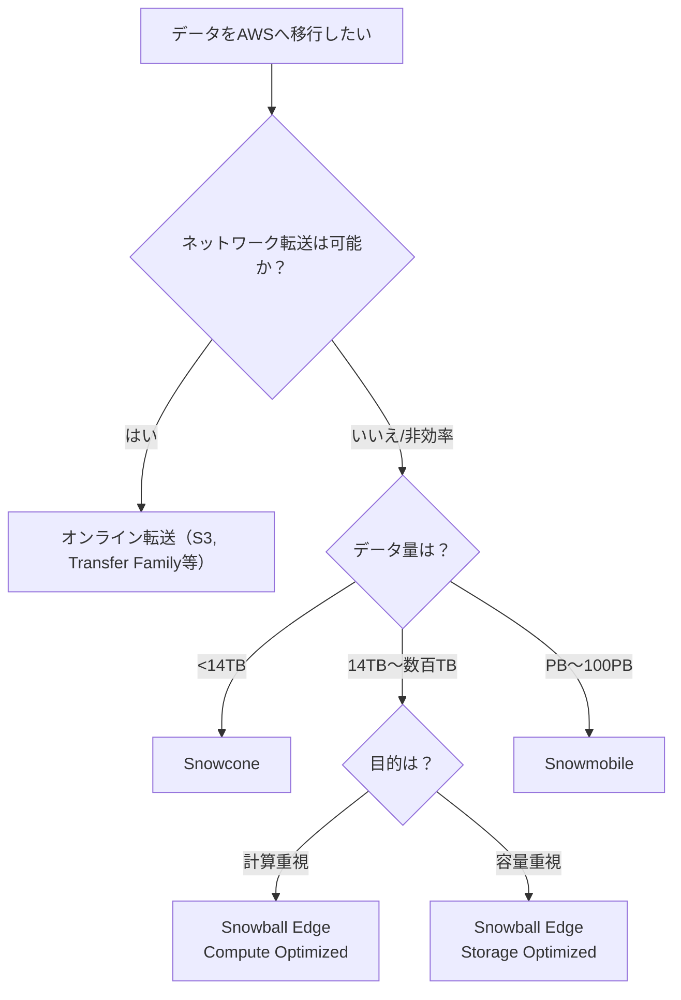

# 🌐 AWS クラウド移行

> - AWS クラウドの移行とイノベーションを理解する
> - AWS クラウド導入フレームワーク (AWS CAF) の概要を説明する 
> - クラウド移行戦略の 6 つの主な要素について簡単に説明する
> - AWS Snowcone、AWS Snowball、AWS Snowmobile などの AWS のデータ移行ソリューションの利点について説明する
> - AWS の幅広い革新的なソリューションの概要を説明する

## クラウド移行とは？

- クラウドへの移行は**一連のプロセス**であり、魔法のように一瞬で完了するものではない。
- AWSへのアプリケーション移行には**多大な労力と専門知識**が必要。
- 幸い、すでに多くの企業が成功事例を持ち、**ナレッジやベストプラクティスが共有**されている。

## 関係者の役割と視点（パースペクティブ）

- **立場により求められる知識や支援は異なる**  
    - 開発者
    - クラウドアーキテクト
    - ビジネスアナリスト
    - ファイナンスアナリスト
- 各メンバーが持つ異なる視点を**統一し、共有する必要**がある。
- 人事部門も、**適切な人材確保とコスト調整**を行う必要がある。

## AWS Cloud Adoption Framework（CAF）

- **AWS プロフェッショナルサービスチーム**が策定したクラウド移行ガイドライン。
- **迅速かつスムーズな移行**を支援するために設計されている。
- **6つのパースペクティブ（重点分野）に基づいてアドバイスを提供：

### ・ビジネス機能に焦点を当てた3つのパースペクティブ

|パースペクティブ|対象の職種|
|---|---|
|ビジネス|ビジネスアナリスト、財務担当|
|人員（People）|人事担当者|
|ガバナンス|経営管理層・監査部門など|

### ・技術機能に焦点を当てた3つのパースペクティブ

|パースペクティブ|対象の職種|
|---|---|
|プラットフォーム|クラウドアーキテクト|
|セキュリティ|セキュリティエンジニア|
|オペレーション|運用担当、SRE、DevOps担当|

## CAFの活用

- 各パースペクティブに基づき、**スキルやプロセスの不足を特定**し、入力情報として整理。
- これをもとに「**AWS Cloud Adoption Framework アクションプラン**」を策定。
- アクションプランは、**クラウド移行に伴う組織の変革をガイド**する。

## 結論

- クラウド移行は複雑だが、**豊富なリソースと実績があるため心配不要**。
- **CAFは効果的な計画策定のための強力なツール**であり、成功への道筋を明確にする。

---

# AWS クラウド導入フレームワーク（CAF）の 6 つの主要パースペクティブ

> AWS CAF（Cloud Adoption Framework）は、クラウド移行を成功に導くために組織の視点を6つのパースペクティブ（重点分野）に分類し、それぞれの観点から移行戦略とプロセスを整理します。

---

## 📌 ビジネスのパースペクティブ（Business Perspective）

- **目的**：IT 投資をビジネス成果に結びつける。戦略の整合性を確保する。
    
- **主な活動**：
    
    - ビジネスケースの作成
        
    - IT 戦略とビジネス目標の一致
        
- **典型的な役割**：
    
    - ビジネスマネージャー
        
    - 財務マネージャー
        
    - 予算担当者
        
    - 戦略関係者
        

---

## 👥 人員のパースペクティブ（People Perspective）

- **目的**：クラウド導入に必要な組織構造・役割・スキル・プロセスを評価し、変更管理を支援。
    
- **主な活動**：
    
    - ギャップ分析
        
    - トレーニング計画と人員配置の優先順位化
        
- **典型的な役割**：
    
    - 人事担当
        
    - 人材マネージャー
        
    - 組織開発リーダー
        

---

## 📊 ガバナンスのパースペクティブ（Governance Perspective）

- **目的**：IT 戦略とビジネス戦略の一致、リスク最小化、価値最大化。
    
- **主な活動**：
    
    - 投資の評価・測定
        
    - クラウドガバナンスのプロセスとスキル整備
        
- **典型的な役割**：
    
    - CIO（最高情報責任者）
        
    - プログラムマネージャー
        
    - エンタープライズアーキテクト
        
    - ビジネスアナリスト
        
    - ポートフォリオマネージャー
        

---

## 🧱 プラットフォームのパースペクティブ（Platform Perspective）

- **目的**：新規ソリューションの導入やオンプレミスワークロードの移行を支援するための技術設計。
    
- **主な活動**：
    
    - IT システムの構造設計
        
    - 目標アーキテクチャの策定
        
- **典型的な役割**：
    
    - CTO（最高技術責任者）
        
    - IT マネージャー
        
    - ソリューションアーキテクト
        

---

## 🔐 セキュリティのパースペクティブ（Security Perspective）

- **目的**：クラウド環境におけるセキュリティの可視性、制御、監査対応、柔軟性の確保。
    
- **主な活動**：
    
    - セキュリティ要件の定義
        
    - セキュリティ制御の選定・実装
        
- **典型的な役割**：
    
    - CISO（最高情報セキュリティ責任者）
        
    - IT セキュリティマネージャー
        
    - セキュリティアナリスト
        

---

## 🔧 オペレーションのパースペクティブ（Operations Perspective）

- **目的**：IT ワークロードの運用を定義・支援し、目標のレベルで可用性と復旧を実現。
    
- **主な活動**：
    
    - 運用手順の見直し
        
    - プロセス変更・トレーニングの特定
        
- **典型的な役割**：
    
    - IT オペレーションマネージャー
        
    - IT サポートマネージャー
        

---

## ✅ パースペクティブの分類まとめ

|分類|パースペクティブ|役割の一例|
|---|---|---|
|**ビジネス機能**|ビジネス、人員、ガバナンス|経営・戦略・人材|
|**技術機能**|プラットフォーム、セキュリティ、オペレーション|技術・運用|

---

# AWS クラウド移行戦略：6つのR（6 Strategies of Cloud Migration）

> オンプレミスからAWSへの移行において、アプリケーションやシステムの特性に応じた適切な移行戦略を選択するための6つのパターン。

---

## 📌 1. リホスト（Rehost）

**別名：Lift and Shift**

- アプリケーションに**一切のコード変更を加えず**、そのまま AWS に移行。
    
- 初期費用が少なく、**移行が迅速に行える**。
    
- レガシー環境からの**大規模移行に適している**。
    
- クラウド移行後の最適化がしやすくなる。
    

✅ **例**：オンプレミスのVMをそのままAmazon EC2へ移行。

---

## 🛠 2. リプラットフォーム（Replatform）

**別名：Lift, Tinker, and Shift**

- 基本はリホストと同じだが、**軽微なクラウド最適化**を含む。
    
- **アプリケーションのコアアーキテクチャは変更しない**。
    
- コード変更を伴わず、**パフォーマンスや運用性を改善**。
    

✅ **例**：MySQL → Amazon RDS、または Amazon Aurora へ変更。

---

## 🔧 3. リファクタリング（Refactor） / 再設計（Re-architect）

- **クラウドネイティブ機能を活用**し、アプリケーションを**再設計・再構築**。
    
- **機能追加、スケーラビリティ、パフォーマンス**向上が目的。
    
- **開発リソースやコストが最も高い**が、将来性・効果も大きい。
    

✅ **例**：モノリシックアプリ → サーバーレスアーキテクチャに再構築。

---

## 💳 4. 再購入（Repurchase）

- **レガシーソフトウェアのライセンスを放棄**し、**SaaSベースの製品へ移行**。
    
- **再構築せずに機能を置き換える**ことが可能。
    
- 初期コストがかかるが、運用・保守が簡素化される。
    

✅ **例**：オンプレミスCRM → SalesforceなどSaaS製品へ移行。

---

## ⏸ 5. 保持（Retain）

- 一時的に**オンプレミス環境に維持**すること。
    
- 廃止予定のアプリや、現時点で移行が難しいアプリに適用。
    
- 将来的な移行や廃止のために**保留状態**にする戦略。
    

✅ **例**：依存関係が多く移行できない旧システムを一時保留。

---

## ❌ 6. 廃止（Retire）

- **不要になったアプリケーションを削除・廃止**する。
    
- 無駄なコスト・管理負担を軽減。
    
- 移行前の調査で**利用されていない資産を特定**することが鍵。
    

✅ **例**：利用実績のない社内ツールや旧版アプリの廃止。

---

## ✅ 6つのR まとめ表

|戦略|内容|コスト|メリット|適用例|
|---|---|---|---|---|
|リホスト|変更せず移行|低|迅速、簡単な開始|EC2移行など|
|リプラットフォーム|一部クラウド最適化を適用|中|パフォーマンス向上、コード変更なし|RDS, Auroraなど|
|リファクタリング|設計から再構築|高|クラウドネイティブ活用、高柔軟性|サーバーレス、マイクロサービス化|
|再購入|SaaS製品へ移行|中～高|メンテ不要、導入が早い|SalesforceなどSaaS導入|
|保持|一時的にオンプレミスに残す|低|後日移行可能|古い基幹系|
|廃止|利用されていないものを削除|最低|コスト削減|不使用の社内ツール|

---

# AWS Snow ファミリー

> **AWS Snow ファミリー**は、大容量データを**物理的に AWS に転送**するための専用ハードウェア群。インターネット回線や専用線が**時間やコスト面で非現実的な場合の代替手段**として設計されています。

---

## ✅ Snow ファミリーとは？

- インターネットや専用線では転送に数日〜数か月かかる大規模データを、**物理デバイス経由でAWSに安全・高速に転送**。
    
- 転送後、**Amazon S3** などに自動でデータを保存。
    
- デバイスはすべて **256ビット暗号化**、**AWS KMS連携**でセキュリティ確保。
    
- 対象：動画・画像・分析データ・テープバックアップ など。
    

---

## 📦 Snow ファミリーの3製品

|デバイス|容量目安|特徴|ユースケース例|
|---|---|---|---|
|**Snowcone**|最大 14 TB|軽量・小型・ポータブル|エッジコンピューティング・小規模転送|
|**Snowball Edge**|最大 80 TB|強力な計算力付き中型端末|定期的な大容量転送・遠隔地での処理|
|**Snowmobile**|最大 100 PB|トレーラー輸送の超大容量モデル|データセンター移行・大量テープの置き換え|

---

## 🧊 1. AWS Snowcone

- **小型・堅牢・ポータブル**
    
- 容量：**最大 14TB（従来は8TB）**
    
- コンピューティング：
    
    - 2 CPU、4 GB RAM
        
    - EC2 + IoT Greengrass 対応
        
- ユースケース：
    
    - 遠隔地・現場・災害対応での**軽量データ収集**
        
    - **簡易エッジ処理**
        

---

## 📦 2. AWS Snowball Edge（2種）

### 🚚 Snowball Edge Storage Optimized

- **大規模なデータ転送に最適**
    
- 容量：
    
    - 80 TB HDD（S3互換 + ブロック）
        
    - 1 TB SSD（ブロック）
        
- コンピューティング：
    
    - 40 vCPU、80 GiB RAM
        
    - EC2 sbe1 インスタンス対応
        
- ユースケース：
    
    - ローカル環境での定期バックアップ
        
    - テープライブラリ置換
        

---

### 🧠 Snowball Edge Compute Optimized

- **高性能計算対応：AI・動画処理向け**
    
- 容量：
    
    - 80 TB HDD（S3/EBS互換）
        
    - 28 TB NVMe SSD
        
- コンピューティング：
    
    - 104 vCPU、416 GiB RAM
        
    - オプション：**NVIDIA Tesla V100 GPU**
        
    - 対応：EC2（C5, M5a, G3, P3 等）
        
- ユースケース：
    
    - 機械学習、動画変換、信号処理、遠隔IoT処理
        

---

## 🚛 3. AWS Snowmobile

- **超大規模データ移行向け：最大100PB**
    
- 本体：**長さ14mの専用トラックコンテナ**
    
- セキュリティ機能：
    
    - 改ざん防止、防水、温度管理
        
    - **24時間ビデオ監視、GPS追跡、セキュリティ車両付き**
        
- ユースケース：
    
    - データセンター閉鎖・リフト&シフト
        
    - **ペタバイト・エクサバイト級移行**
        

---

## 🔐 セキュリティと転送フロー

1. コンソールからデバイスを注文
    
2. AWS からお客様へデバイス送付
    
3. お客様がデータをデバイスにコピー
    
4. AWS に返送
    
5. データは**S3 などに自動取り込み**
    

- **暗号化**：256ビット AES（KMS 対応）
    
- **署名済みハードウェア＋ソフトウェア**
    

## AWS Snow ファミリー導入判断のフローチャート

---

## 📘 まとめ

|製品名|容量|特徴|主な用途|
|---|---|---|---|
|Snowcone|～14TB|小型、ポータブル|エッジ収集、災害現場、小規模転送|
|Snowball Edge|～80TB|ストレージ最適 or 計算最適|大量データの定期送付、IoT処理|
|Snowmobile|～100PB|超大容量、トラック型|データセンター移行、大規模一括転送|

---

# 🌐 AWSでできることまとめ｜イノベーションと活用領域

> AWS は、単なるクラウドインフラではなく、**サーバーレス、AI/ML、IoT、衛星通信などあらゆる先端技術に対応した総合プラットフォーム**です。

---

## ✅ AWS活用の全体像

| 領域       | 主なサービス例                               | 主な用途・特徴             |
| -------- | ------------------------------------- | ------------------- |
| サーバーレス   | AWS Lambda, EventBridge, API Gateway  | サーバー管理不要、イベント駆動型開発  |
| 機械学習     | Amazon SageMaker, Amazon A2I          | モデル構築・トレーニング・推論の自動化 |
| AIサービス   | Lex, Comprehend, Transcribe, Textract | チャットボット、自然言語処理、音声認識 |
| IoT      | AWS IoT Core, Greengrass              | エッジデバイスとの連携、遠隔制御    |
| VMware移行 | VMware Cloud on AWS                   | オンプレ環境をそのままAWSに移行可能 |
| 衛星通信     | AWS Ground Station                    | 必要な衛星通信時間だけを支払い     |

---

## ☁ AWSクラウド移行の応用例

### VMware Cloud on AWS

- 既存のオンプレミスVMwareワークロードをAWSへそのまま移行。
    
- **同じ操作感・ツールチェーンを維持**しつつクラウドのメリットを享受。
    

---

## 🤖 機械学習（ML）とAIの活用

### 🔧 Amazon SageMaker

- オープンソース対応
    
- 構築 → トレーニング → デプロイまで一貫管理
    
- **ノーコード/ローコード**で利用可能
    

### 🧠 代表的AIサービスと用途

|サービス名|機能概要|
|---|---|
|**Amazon Lex**|チャットボット作成（音声・テキスト対応）|
|**Amazon Textract**|文書からの構造化データ抽出|
|**Amazon Transcribe**|音声からテキストへ変換|
|**Amazon Comprehend**|テキストの意味・感情・キーフレーズ抽出|
|**Amazon A2I**|人間による機械学習結果の補完（Augmented AI）|
|**Amazon CodeWhisperer**|コーディング補助、セキュリティ警告|
|**Amazon Fraud Detector**|不正取引の検出|

---

## 🧩 開発者向け教育・体験ツール

### 🚗 AWS DeepRacer

- 強化学習を学べる自動運転ミニカー
    
- 開発者が**遊びながら ML を学習可能**
    

---

## 🚀 サーバーレスアーキテクチャ

### 特徴

- **インフラ管理不要**
    
- イベント駆動型でスケーラブル
    
- 可用性や耐障害性も AWS 側で管理
    

### 主要サービス

|サービス名|機能|
|---|---|
|**AWS Lambda**|関数単位でコード実行|
|**Amazon API Gateway**|API 管理|
|**Amazon EventBridge**|イベント連携|

---

## 🛰 AWS Ground Station（衛星通信）

- ユーザーが衛星を所有せずとも、**衛星データを取得・利用可能**
    
- 使用した分だけ支払う「衛星時間課金」
    
- **天気予測、地球観測、災害監視**などに応用可能
    

---

## 🧭 AWSでイノベーションを実現するための3つの問い

|質問|意義|
|---|---|
|現在の状態は？|現状の課題・インフラの明確化|
|目的の状態は？|将来的な目標・あるべき姿|
|解決したい課題は？|技術選定・最適戦略の基準|

---

## 📘 今後の学習・探求テーマ例

- サーバーレス × 機械学習
    
- IoT × Edge × Snowシリーズ
    
- CodeWhisperer と開発自動化
    
- Amazon SageMaker Studio Lab 活用
    
- Amazon QuickSight による可視化とBI分析

---

## 🤖 Amazon CodeWhisperer

> AI を活用したコーディング支援ツール：**自然言語 → コード生成**、**セキュリティ支援**、**開発効率向上** を実現

---

## ✅ CodeWhispererとは？

- **Amazon CodeWhisperer** は、**AIベースのコーディングコンパニオン**。
    
- 開発者のコメントやコードを読み取り、**適切なコードスニペットをリアルタイムで提案**。
    
- **統合開発環境（IDE）で直接動作**し、開発ワークフローを効率化。
    

---

## 🔍 主な機能と特徴

### 🌐 自然言語処理によるコード生成

- 英語コメントを理解し、**意図に合った関数・コードブロックを提案**。
    
- 例：`// fetch user data from API` と書くと、APIコールに必要なコードを自動補完。
    

### ✍ コーディングスタイルの適応

- 周囲のコードから**命名規則・記述スタイルを学習**し、統一感ある提案が可能。
    

### 🔐 セキュリティスキャン機能

- **OWASP**や**AWSセキュリティベストプラクティス**に基づき、脆弱性のあるコードを検出。
    
- セキュリティスキャンは定期的に更新され、**最新の脅威に対応**。
    

### 🧠 オープンソースリファレンストラッカー

- 提案されたコードが**オープンソースに由来するかを明示**し、**知的財産保護**に貢献。
    

---

## 🚀 CodeWhispererの利点（開発者と組織両方に）

|開発者のメリット|組織のメリット|
|---|---|
|コーディング速度の向上|アプリ開発の高速化|
|新しい言語の学習負荷軽減|コード品質と一貫性の向上|
|スタイルに合った補完提案|セキュリティリスクの軽減|
|繰り返し作業の自動化|開発チームの生産性向上|

---

## 📘 まとめ

|特徴|説明|
|---|---|
|自然言語理解|英語コメントからコードを自動生成|
|スタイル自動適応|コードの命名やフォーマットを自動認識|
|セキュリティチェック|脆弱性を自動検出し、ベストプラクティスに準拠|
|知的財産保護|オープンソース由来コードの出所を明示|
|IDE連携|Visual Studio Code、JetBrains IDE など主要環境に対応|

---

## 📎 参考リンク（学習を深めたい方向け）

- [Amazon CodeWhisperer 公式ページ](https://aws.amazon.com/codewhisperer/)
    
- [SaaS 利用プランと無料枠](https://docs.aws.amazon.com/codewhisperer/latest/userguide/getting-started.html)
    
- [セキュリティとライセンス FAQ](https://docs.aws.amazon.com/codewhisperer/latest/userguide/security.html)
    

---
# その他のリソース

モジュール 9 で学習した概念の詳細については、以下のリソースを参照してください。

- [Amazon CodeWhisperer  (opens in a new tab)](https://aws.amazon.com/codewhisperer/)
- [Amazon CodeWhisperer - 開始方法(opens in a new tab)](https://explore.skillbuilder.aws/learn/course/external/view/elearning/16405/amazon-codewhisperer-getting-started)
- [AWS での移行と転送(opens in a new tab)](https://aws.amazon.com/products/migration-and-transfer)
- [クラウドへの大規模な移行のプロセス(opens in a new tab)](https://aws.amazon.com/blogs/enterprise-strategy/214-2/)
- [6 Strategies for Migrating Applications to the Cloud(opens in a new tab)](https://aws.amazon.com/blogs/enterprise-strategy/6-strategies-for-migrating-applications-to-the-cloud/)
- [AWS クラウド導入フレームワーク (CAF)(opens in a new tab)](https://aws.amazon.com/professional-services/CAF/)
- [AWS の基礎: 主要概念(opens in a new tab)](https://aws.amazon.com/getting-started/fundamentals-core-concepts/)
- [AWS Cloud Enterprise Strategy Blog(opens in a new tab)](https://aws.amazon.com/blogs/enterprise-strategy/)
- [Modernizing with AWS ブログ(opens in a new tab)](https://aws.amazon.com/blogs/modernizing-with-aws/)
- [AWS お客様事例: データセンターの移行](https://aws.amazon.com/solutions/case-studies/?customer-references-cards.sort-by=item.additionalFields.publishedDate&customer-references-cards.sort-order=desc&awsf.customer-references-location=*all&awsf.customer-references-segment=*all&awsf.customer-references-product=product%23vpc%7Cproduct%23api-gateway%7Cproduct%23cloudfront%7Cproduct%23route53%7Cproduct%23directconnect%7Cproduct%23elb&awsf.customer-references-category=category%23datacenter-migration)